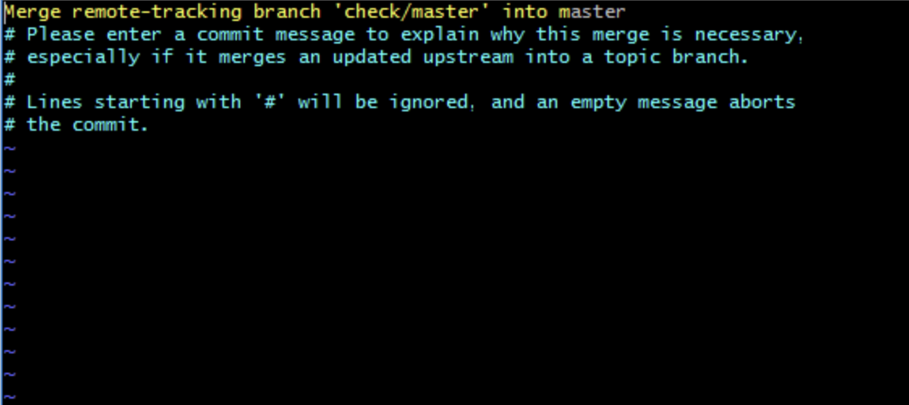

# Git Cheatsheet

## Working in Teams with Branches

### Creating and Moving Between Branches

Each team member should own their own branch and work exclusively on that branch.

To create a branch run:

```sh
git branch ben-branch-feature-A
```

To see all branches, run:

```sh
git branch
```

You should then see: (the `*` indicates the current branch)

```
  main
* ben-branch-feature-A
```

**When working, always check to make sure that you are NOT working in the `main` branch**

To switch back and forth between `main` and your branch, run:

```sh
git checkout main
git checkout ben-branch-feature-A
```

### Pulling Code and Merging With Your Branch

When a teammate pushes their code to the remove `main` branch, you want to ensure that your local `main` branch is up to date as well as your own local branch.

First, switch to the `main` branch and `pull` the changes:

```sh
git checkout main
git pull
```

Then, switch back to your branch and merge the changes from `main` into your branch.

```sh
git checkout ben-branch-feature-A
git merge main
```

You may need to resolve merge conflicts at this point. 

If you see this screen asking you to enter a commit message, simply type <kbd>:q</kbd> to quit and accept the default merge message.



### Pushing Code

When you're ready to push your changes to the remote repository, follow the steps listed above in [Pulling Code and Merging With Your Branch](#pulling-code-and-mergine-with-your-branch) to ensure you have the most recent changes.

Then, in your branch you can run:

```sh
git add .
git commit -m 'a message describing your changes'
git push
```

Go to Github.com and open up your repository. Then, click on the <kbd>Pull Requests</kbd> tab to create a new pull request to merge your branch into `main`. Ask your teammates to review your code and then merge!

If you want to continue working on your branch, do NOT delete the branch.

Your teammates can then follow the steps listed in [Pulling Code and Merging With Your Branch](#pulling-code-and-mergine-with-your-branch) to update their local repositories.
