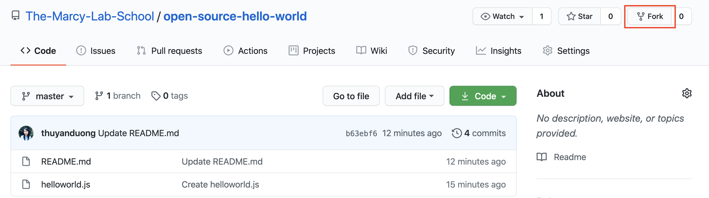
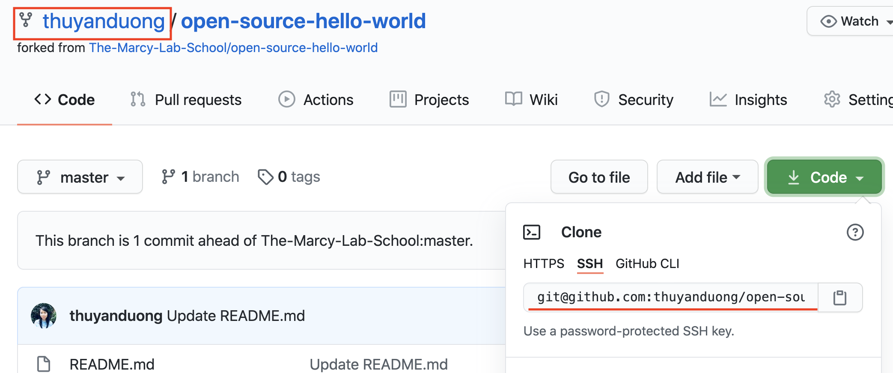
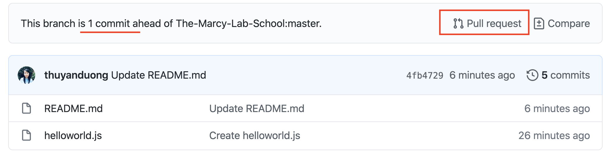
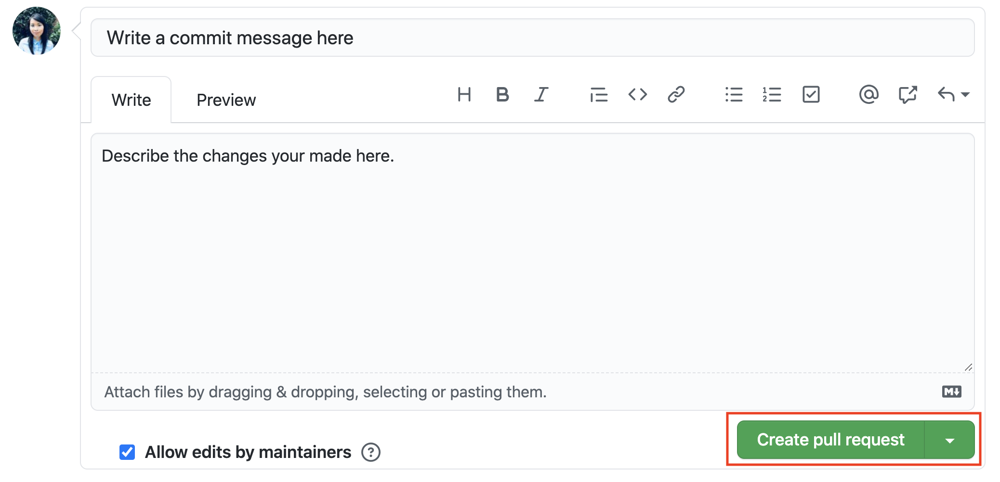

# Pull Request Practice

When a project is **_open source_**, that means anybody is free to use, study, modify, and distribute your project for any purpose. These permissions are enforced through an open source license.

The open source community provides a great opportunity for aspiring programmers to distinguish themselves; and by **_contributing_** to various projects, developers can improve their skills and get inspiration and support from like-minded people.

## Instructions

A friend of yours has created [this repository](https://github.com/The-Marcy-Lab-School/open-source-hello-world).
They are a brand new developer and would benefit from your contributions. Their repository has **_a lot_** of typos, and grammatical mistakes in their `READEME.md`.
They don't even use complete sentences sometimes! Futhermore, they have some bugs in their `helloworld.js` file.

Your job is as followed:
1. Fork [their repository](https://github.com/The-Marcy-Lab-School/open-source-hello-world) by clicking the fork button.

2. Then clone down _your forked_ repository using your terminal by typing`git clone <url>`. You can confirm that you are cloning the _forked_ repo by making sure the webpage has your username in the top left. Once cloned, make improvements to both the `READEME.md` and `helloworld.js` files. 

3. Commit and push your changes to your remote repository.

4. Finally, open a Pull Request so your friend can review (and hopefully approve) your changes.

4a. You can do this by click on "Pull Request" and then "Create pull request".

4b. Near the top, you can confirm that your and making a pull request to merge the master branch of **_your_** repo into the master branch of the **_original_** `The-Marcy-Lab-School` repo. Review your changes, and click "Create Pull Request".

