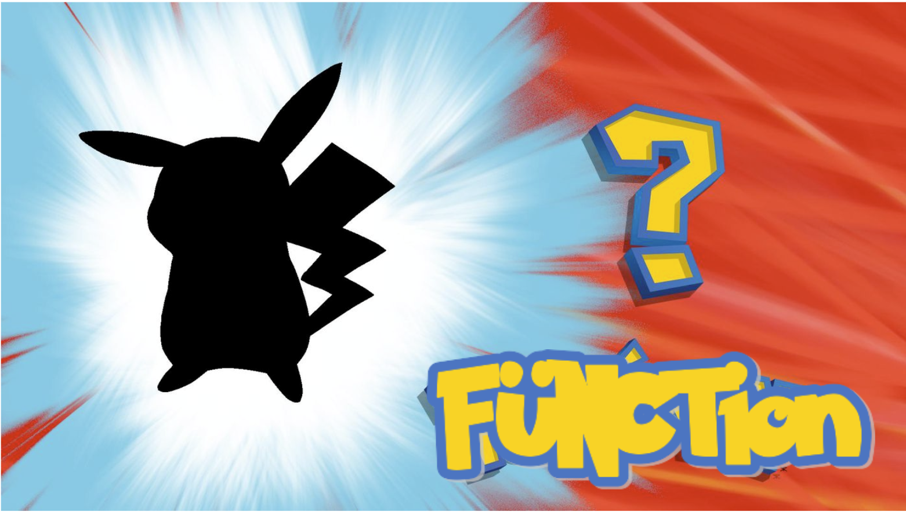

# Who's that function?!?!



Each function declaration below is an implemention of a popular Array method. It's up to you to figure out which is which!

Answers:
* `slice` — returns a portion of an `array`, specified by a `start` and `end` index.
* `concat` — receives 2 `array`  and concatenates them into a new array which is returned.
* `push` — adds one or more `...values` to the end of an `array` and returns the new length of the array.
* `unshift` - adds one `value` to the beginning of an `array` and returns the new length of the array.
* `pop` — removes and returns the last value of an `array`.

#### Function 1

```js
function x(array, ...values) {
    for (let i = 0; i < values.length; i++) {
        array[array.length] = values[i];
    }
    return array.length;
}
```

<details><summary>Answer</summary>

It's `Array.prototype.push`! This function adds `value` to the end of `array`, increasing the length of the array by `1`.

```js
let pets = ['dog', 'cat', 'parrot'];

push(pets, 'cat', 'lizard'); // returns 5

console.log(pets); //> ['dog', 'cat', 'parrot', 'cat', 'lizard']
```

</details>


#### Function 2

```js
function x(array1, array2) {
    return [...array1, ...array2];
}
```

<details><summary>Answer</summary>

It's `Array.prototype.concat`!

```js
const letters = ['a', 'b', 'c'];
const nums = [1,2,3]

const result = concat(letters, nums);

console.log(result); 
//=> logs  ['a', 'b', 'c', 1, 2, 3]
```

</details>


#### Function 3

```js
function x(array) {
    let toReturn = array[array.length - 1];
    array.length--;
    return toReturn;
}
```

<details><summary>Answer</summary>

It's `Array.prototype.pop`!

```js
let pets = ['dog', 'cat', 'parrot'];
let removed = pop(pets); // 'parrot' 

console.log(pets); // => logs ['dog', 'cat']
```

</details>


#### Function 4

```js
function x(array, start = 0, end = array.length) {
    let toReturn = [];
    for (let i = start; i < end; i++) {
        toReturn[toReturn.length] = array[i];
    }
    return toReturn;
}
```

<details><summary>Answer</summary>

It's `Array.prototype.slice`! 

```js
const pets = ['dog', 'cat', 'parrot', 'lizard'];

const firstHalf = slice(pets, 0, 2); // ['dog', 'cat']
const secondHalf = slice(pets, 2); // ['parrot', 'lizard]
const petsCopy = slice(pets); // ['dog', 'cat', 'parrot', 'lizard']
```

</details>


#### Function 5

```js
function x(array, value) {
    for (let i = array.length; i >= 1; i--) {
        array[i] = array[i-1];
    }
    array[0] = value;

    return array.length;
}
```

<details><summary>Answer</summary>

It's `Array.prototype.unshift`!

```js
array = [1,2,3,4,5]
console.log(unshift(array, 'a')) // 6
console.log(array); // ['a', 1, 2, 3, 4, 5]
```

</details>

#### Function X

```js
function x(array, value) {
    
}
```

<details><summary>Answer</summary>

It's `Array.prototype.____`!

```js
```

</details>