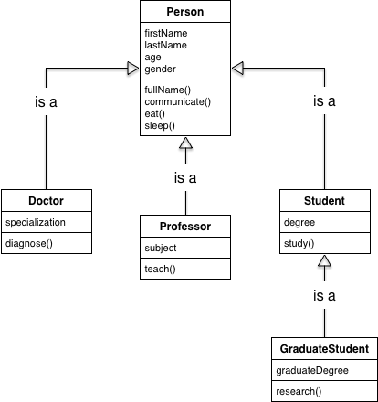

# Inheritance

**Inheritance** is a pillar of object-oriented programming. It describes a relationship between two classes: a **subclass** that inherits methods from a **superclass**. As a result, instances of the sub-class can use methods defined in a super-class. 

**Question: What are two of JavaScript's essential data types that demonstrate inheritance? Which is the subclass and which is the superclass?**

<details><summary>Answer</summary>

The `Array` class is a sub-class of the `Object` class which is the super-class.

Every Array inherits methods from the `Array.prototype` which inherits methods from the `Object.prototype`. Therefore, all arrays can use `Object.prototype` methods like `toString()`.

</details>
<br>

### Inheritance Chain

Inheritance can exist in a chain in which a sub-sub-class can inherit from a sub-class which inherits from a super-class.



**Question: What is the inheritance relationship between the `Professor` class and the `Person` class? What about the `GraduateStudent` class and the `Person` class?**

### Establishing Inheritance Between Custom Classes

Imagine we have our `Person` class and we want to make another called `Programmer`. It will inherit the properties and methods of the superclass `Person` but it will have additional properties and behaviors that only instances of `Programmer` will have.

```js
class Person {
  constructor(name, age) {
    this.name = name;
    this.age = age;
    this.friends = [];
  }
  makeFriend(friend) {
    this.friends.push(friend)
    console.log(`Hi ${friend}, my name is ${this.name}, nice to meet you!`);
  }
  doActivity(activity) {
    console.log(`${this.name} is ${activity}`);
  }
}

class Programmer {
  constructor(name, age, language) {
    this.name = name;
    this.age = age;
    this.friends = [];
    this.favoriteLanguage = language
  }
  makeFriend(friend) {
    this.friends.push(friend)
    console.log(`Hi ${friend}, my name is ${this.name}, nice to meet you!`);
  }
  doActivity(activity) {
    console.log(`${this.name} is ${activity}`);
  }
  code() {
    this.doActivity(`writing some ${this.favoriteLanguage} code.`);
  }
}
```

**What bad practice exists this code?**

To remove the repetative code AND to establish a relationship betwen `Programmer` and `Person`, we use the `extends` and `super` keywords to define our `Programmer` class:

```js
class Person {
  constructor(name, age) {
    this.name = name;
    this.age = age;
    this.friends = [];
  }
  makeFriend(friend) {
    this.friends.push(friend)
    console.log(`Hi ${friend}, my name is ${this.name}, nice to meet you!`);
  }
  doActivity(activity) {
    console.log(`${this.name} is ${activity}`);
  }
}

class Programmer extends Person {
  constructor(name, age, language) {
    super(name, age);
    this.favoriteLanguage = language
  }
  
  // makeFriend is inherited
  // doActivity is inherited
  
  code() { // a new method only Programmer instances can use
    this.doActivity(`writing some ${this.favoriteLanguage} code.`);
  }
}
```

Using these classes, do the following:

* Create an instance of `Programmer`
* Invoke all of the methods that the instance inherits
* Use the `instanceof` operator to confirm that your instance is a `Programmer` AND a `Person`


Then, with a partner, discuss these questions:

**Question 1: What does `extends` do?**

**Quesiton 2: What does `super` do?**

**Question 3: What do we know about the relationship between a `Programmer` and a `Person`?**

**Question 4: How does the `code` method work?**

<details><summary>Ben's Answer</summary>

* `extends` makes the `Programmer` inherit methods from `Person`. It sets `Person.prototype` as the prototype for `Programmer.prototype`
* `super()` invokes the `Person` constructor function using its own value of `this`.
* `Programmer` is said to be a **subclass** of `Person`. 
* `Person` is said to be a **superclass** of `Programmer`.
* `Programmer` will inherit properties and methods 
from `Person`
* Instances of `Programmer` are also instances of `Person`
* `code` invokes the `doActivity` method inherited from `Person.prototype`

</details>

## Polymorphism

Polymorphism means "many forms".

Pollymorphism is a concept in object-oriented programming where multiple types of objects share "signatures" (they have the same property and method names even if their values/implementations are different).

The impact of polymorphism is that our program can reliably use different types of objects in the same way if they all descend from the same parent class.

```js
class Person {
  constructor(name, age) { /*...*/ }
  makeFriend(friend) { /*...*/ }
  doActivity(activity) { /*...*/ }
}

class Programmer extends Person {
  constructor(name, age, language) { /*...*/ }
  code() { /*...*/ }
}

class ProgrammingTeacher extends Programmer {
  constructor(name, age, language) {
    super(name, age, language)
  }
  teach() {
    super.doActivity(`showing their ${this.favoriteLanguage} code to their class`);
  }
}

const ben = new Person("Ben", 28);
const reuben = new Programmer("Reuben", 35, "JavaScript");
const carmen = new ProgrammingTeacher("Carmen", 22, "JavaScript");

const people = [ben, reuben, carmen];

// Ben, reuben, and carmen are all hanging out
// Maya enters the room and wants to be friends with everyone!
// Because everyone is a Person, we can do this:
people.forEach(person => person.makeFriend("Maya"))
```

This demonstrates polymorphism because `ben`, `reuben`, and `carmen` are all descendants of `Person` which we know defines a `makeFriend` method. Even though `reuben` and `carmen` are different subtypes, we can treat them as `Person` objects as well.

A `Person` can come in "many forms".

## Using Classes with Other Classes

**Challenge: Refactor the `makeFriend` method so that instead of adding a friend's name, it takes in a Person object. When a person is added as a friend, both person objects should have each other as friends.**

<details><summary>Ben's Solution</summary>

We only have to modify the `Person` class and all subclasses will inherit the new behavior. Instead of passing in a friend's name, pass in the entire Person object and have both friends add each other to the friend list.

We have to be careful to not create an infinite recursion. We will end up with a **circular reference** though.

```js
class Person {
  constructor(name, age) {
    this.name = name;
    this.age = age;
    this.friends = [];
  }
  makeFriend(friend) {
    if (this.friends.includes(friend)) {
      return;
    }
    
    this.friends.push(friend)
    console.log(`Hi ${friend.name}, my name is ${this.name}, nice to meet you!`);
    
    friend.makeFriend(this);
  }
  doActivity(activity) {
    console.log(`${this.name} is ${activity}`);
  }
}

const ben = new Person("Ben", 28);
const carmen = new Person("Carmen", 22);
const reuben = new Person("Reuben", 35);

ben.makeFriend(carmen);
ben.makeFriend(reuben);

console.log(ben, reuben, carmen)
```

</details>

## Challenge: User & Admin

## Challenge

Create two classes, `User` and `Admin`.

A `User` should have the following properties:
* `username` a string provided to the constructor
* `isOnline` with a default value `false`

A `User` should have the following methods:
* `login` sets `isOnline` to `true` and prints `<username> has logged in!`
* `logout` sets `isOnline` to `false` and prints `<username> has logged out!`

An `Admin` should be a subclass of `User`. It should also have:
* A property `isAdmin` set to `true`
* A method called `doSecretAdminStuff` that just prints a message `"Doing secret admin stuff"`.

Then, create a user instance and an admin instance and demonstrate how to use all of their methods.