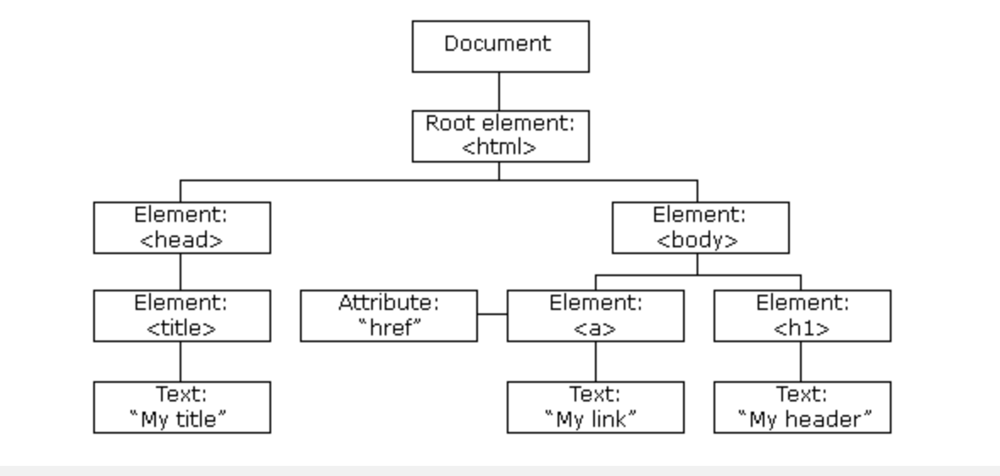

# Unit 5 Lesson 0 Practice
## Intro to the DOM and Trees

1. Write a brief description of what the DOM is.

2. Draw a diagram of the DOM tree for the `sample.html` file below.

      ```html
      <html>
          <head>
              <h1>Hello</h1>
          <head>
          <body>
              <p id=”school">”Marcy Lab”</p>
              <p id=”chief-program-officer">”Maya”</p>
          </body>
      </html>
      ```

3. Convert the tree below to HTML code.
.

4. How many nodes does the following HTML snippet have. Draw the DOM tree.
      ```html
      <html>
            <head>
            </head>
            <body>
                  <div>
                        Hello and welcome!
                        <p>Then press the <em>Draw</em> button</p>
                        Thank you for visiting!
                  </div> 
            </body>
      </html>
      ```

5. How many nodes does the following HTML snippet have. Draw the DOM tree.
      ```html
      <html>
            <head>
            </head>
            <body>
                  <div><p>Then press the <em>Draw</em> button</p></div> 
            </body>
      </html>      ```

6. How many direct and indirect child nodes does each parent node — starting with the element with an id of 1 — have in the DOM generated by the following HTML:
      ```html
      <div id="1">
        <h1 id="2">Hello, <em id="3">World</em></h1>
        <p id="4">
          Welcome to wonderland. This is an
          <span id="5">awesome</span> place.
        </p>
        <a href="#" id="6"><strong id="7">Enter</strong></a>
        <div id="8"><p id="9"><a href="#" id="10">Go back</a></p></div>
      </div>
      ```
    Consider the following when counting the direct and indirect child nodes for each parent node:

    * Any DOM node that has at least one child node is a parent node.
    * Indirect child nodes are the child nodes of child nodes
