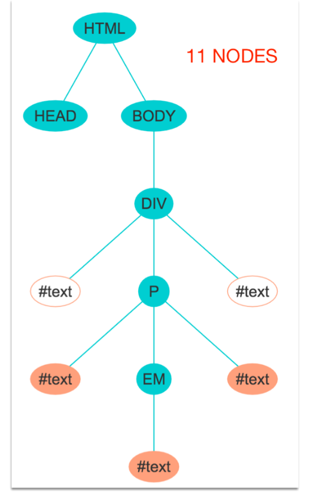
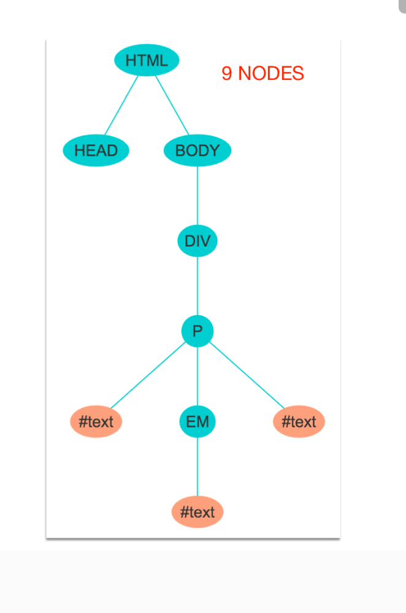
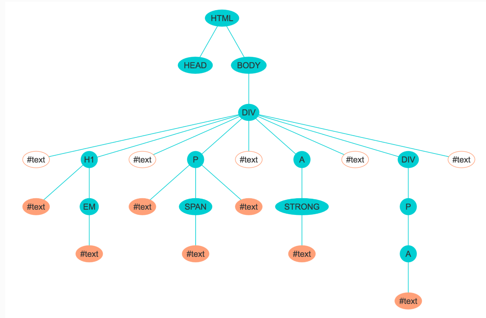
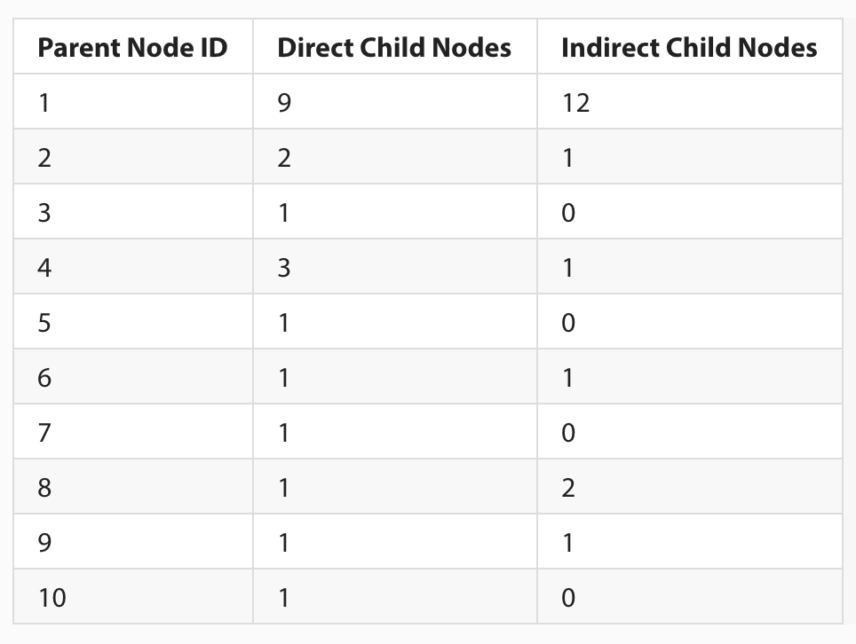

## Intro to the DOM and Trees

1. DOM stands for document object model. It is a data representation of the objects that comprise the structure and content of web page.  When you open a web page in your browser, the browser retrieves the page’s HTML text and parses then the browser builds up a model of the document’s structure and uses this model to draw the page on the screen. The DOM can be read or modified. When the DOM is modified, the web page in the browser will be updated to reflect those changes.

2. 


3. 
      ```html
      <!DOCTYPE html>
      <html>
          <head>
              <title>My Title</title>
          </head>
          <body>
              <a href="/something-here">My Link</a>
              <h1>My header</h1>
          </body>
      </html>
      ```

4.  

5. 

6. 

    Using the above DOM representation of ALL the nodes, we can count the direct and indirect child nodes for each parent node. Here is the table summarizing the count:

    
