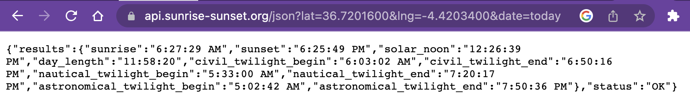

# Fetch API

### But first, a recap

So far, we should be familiar with the following concepts:
* HTTP requests and responses
* Asynchronous code is non-blocking
* We can use callbacks to execute code after an asynchronous operation completes. But this creates ugly "callback hell" code
* Promises are objects that represent the eventual completion of code. They start out pending and then are either fulfilled or rejected.
* A fulfilled Promise will invoke `resolve()` with the promised data
* A rejected Promise will invoke `reject()` with error data
* `.then()` can be used to handle fulfilled Promises
* `.catch()` can be used to handle rejected Promises

### Application Programming Interfaces

**Fetching is all about programmatically getting data from an API.**

An API (Application Programming Interface) is a programming tool to perform a specific task. All APIs exposes an interface that let's programmer's use that tool. APIs come in many forms with different kinds of interfaces.

For example, the **DOM API's interface** comes in the form of methods attached to the `document` object (e.g. `document.getElementById` and `document.createElement`). This is because the DOM API is focused on adding _functionality_ to your application.

Web APIs focus on adding _data_ to your applications and they use URLs to provide a direct path to their data.

To start, let's look at a Web API. 
* Here are a few I recommend (From [this list](https://mixedanalytics.com/blog/list-actually-free-open-no-auth-needed-apis/)):
    * Daily astronomical picture: https://go-apod.herokuapp.com/apod
    * Get the current Sunrise/Sunset: https://api.sunrise-sunset.org/json?lat=36.7201600&lng=-4.4203400&date=today
* Paste the URL in the browser's address bar to see what it looks like when we fetch the data using the browser

You will most likely see something like this:



### URLs

Every URL has a few parts. Understanding those parts can help us fetch precisely the data we want.

Consider this URL which tells us information about the sunrise and sunset at a partiuclar [latitude and longitude](https://en.wikipedia.org/wiki/Geographic_coordinate_system#Latitude_and_longitude):

```
https://api.sunrise-sunset.org/json?lat=36.7201600&lng=-4.4203400&date=2023-3-15
```

Let's break it down:
* `https://api.sunrise-sunset.org` — This is the **host**. It tells the client where the resource is hosted/located.
* `/json` - This is the **path**. It shows what resource is being requested
* `?lat=36.7201600&lng=-4.4203400&date=2023-3-15` - These are **query parameters** and this particular URL has 3: `lat`, `lng`, and `date`. Query parameters begin with a `?` are are separated with `&`. Each parameter uses the format `name=value`. Try changing the `date` parameter!

When using a new API, make sure to look at that APIs [documentation](https://api.sunrise-sunset.org) (often found at the host address) to understand how to format the request URL.

### JSON


Look closely at the response data and you'll notice that the data is contained within curly braces `{}` — it's an object! But it's a special kind of object called a JSON object. 

JSON stands for JavaScript Object Notation. It is a file format for transmitting data via the internet.

Keep this in mind for later...

### Programatically Fetching with `fetch`

[Click here to fork the example repo](https://github.com/The-Marcy-Lab-School/intro-to-fetch-example/fork)

`fetch` is a method native to all browsers (and in Node v.18) that sends an HTTP request to the provided `url`. 

```js
const fetchPromise = fetch('https://go-apod.herokuapp.com/apod');
// fetch returns a Promise object
console.log(fetchPromise); // prints [object Promise] { ... }
```

`fetch` returns a `Promise` that resolves to a [response](https://developer.mozilla.org/en-US/docs/Web/API/Response) object containing the fetched data. Printing the returned Promise won't show us the data. We need to extract it.

### Then

To use a Promise's data, we use the `then` method on the returned `Promise`. 

```js
const dataPromise = fetchPromise.then(response => {
    const data = response.json(); // converts response (which is in the JSON format) into a plain object
    return data; // the value returned will be wrapped in a new Promise
})
```

Let's break it down:
* `then` takes a callback that is executed when the `Promise` is fulfilled. The callback is given a single argument, the data that the Promise resolves to.
* Promises returned by `fetch` resolve to JSON-formatted data, so we have to first convert it to a plain JavaScript object (`response.json()`)
* `then` also returns a Promise. That Promise will resolve to whatever its callback returns.

```js
dataPromise.then(data => {
    // do stuff with the data
    console.log(data) // prints the raw data
})
```

Or, more elegantly:

```js
fetch('https://go-apod.herokuapp.com/apod') // returns a Promise
    .then(response => response.json()) // also returns a Promise
    .then(data => {
        // do stuff with the data
        console.log(data) // prints the JSON data
    })
```

To summarize:
* `fetch` is provided a url to fetch data from. It returns a Promise
* When that `fetch` Promise is fulfilled, the first `then` callback is executed. The resolved `response` from the `fetch` call is provided as an argument. 
* The `response` from the `fetch` call is in JSON format so we have to convert it to a plain JS object with the `.json()` method. 
* `.json()` is also an asynchronous function that returns a Promise.
* When the `response.json()` Promise is fulfilled, the second `then` callback is executed. The resolved `data` from `response.json()` is provided as an argument and we can do whatever we need to with the data!

### Catch

If the Promise is rejected, we need to handle the error that the Promise provides. To do this, we add the `catch` method to our "Promise chain":

```js
fetch('https://go-apod.herokuapp.com/apod') // returns a Promise
    .then(response => response.json()) // also returns a Promise
    .then(data => {
        // do stuff with the data
        console.log(data) // prints the JSON data
    })
    .catch(error => console.log(error))
```


### Eample: Manipulate the DOM with a fetch

Often, we need to manipulate the DOM in response to a `fetch` call. To make a simple program that does this, we will typically follow these steps:

1. Create HTML elements (give them ids)
2. Create variables for those DOM elements in JS
3. Fetch data
4. convert from JSON 
5. use the data to manipulate the DOM elements
6. Bonus: we can make a button to fetch new data

[Here is an exmaple that demonstrates this!](https://jsbin.com/casuneb/4/edit?html,js,output)