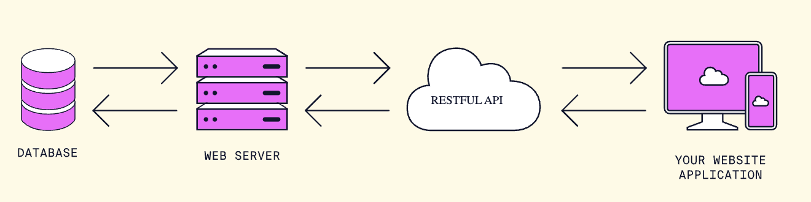
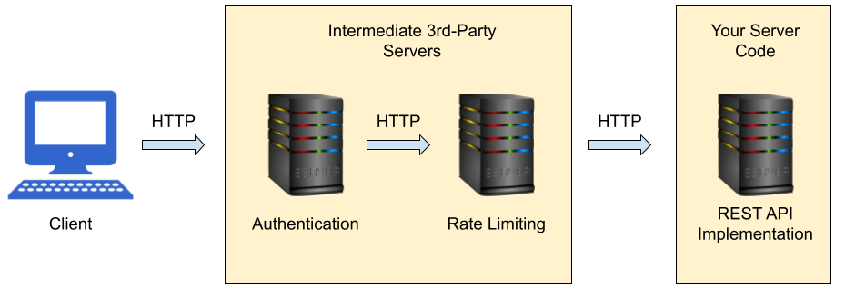

# Representational State Transfer

[_Additional Reading_](https://www.codecademy.com/courses/learn-node-js/articles/what-is-rest)


## What is REST?



APIs act as a middle-man between the client and servers. They define _how_ a client can easily retreive the data they need.

REST is a set of design principles for creating and interacting with APIs. APIs that follow these principles are called **RESTful APIs**.

> REST stands for **Re**presentational **S**tate **T**ransfer. **State** refers to the current set of data for an application. REST refers to how we **represent** that state in a uniform format (JSON, XML, HTML) and **transfer** it to a client. 

## The Principles of REST

### **Uniform Interface**: 

REST APIs follow a consistent set of rules and conventions for accessing and manipulating resources. This makes it easy for developers to understand and use the API.

All HTTP requests include a path to the specific resource they are requesting. Typically, they follow a `plural/id` format like this:

```
/resources
/resources/resource_id
```

The `/resources` path provides all of the resources for a particular path while the `/resources/resource_id` path provides a specific resource from that set. Resource paths can be nested depending on how complex the REST API structure is:

```
/resources/resource_id/sub_resource/sub_id
```

For example, an online book API might have the following paths available:

```
http://bookstore.com/books/
http://bookstore.com/books/543
http://bookstore.com/authors/123
http://bookstore.com/authors/123/books
http://bookstore.com/authors/123/books/3
http://bookstore.com/publishers/1/authors/123/books
http://bookstore.com/publishers/1/authors/123/books/3
```

**Question**: What resource do each of the paths return?

There are 4 basic HTTP verbs we use in requests to interact with resources in a REST system:

- `GET` — retrieve a specific resource (by id) or a collection of resources
- `POST` — create a new resource
- `PUT`/`PATCH` — update a specific resource (by id)
- `DELETE` — remove a specific resource by id

<details><summary><strong>Example</strong>:</summary>

An online bookstore has a REST API that follows a consistent set of rules and conventions. 
* To retrieve a list of books, clients send a `GET` request to the endpoint `/books`. 
* To create a new book, clients send a `POST` request with the book's data to the same endpoint.
* To update a specific book's information, clients send a `PUT` request with the updated data to the endpoint `/books/{book_id}`, where `{book_id}` is the unique identifier of the book.
* To delete a book, clients send a `DELETE` request to the endpoint `/books/{book_id}`, where `{book_id}` is the unique identifier of the book.

</details>

### **Stateless**: 

Each request from a client to a server should contain all the information needed to process that request. The server should not store any information about the client's state between requests.

**Question**: What kind of data can be provided with an HTTP request to provide statefulness?

<details><summary><strong>Example</strong>:</summary>

Assume we have an e-commerce application with a REST API for user authentication. When a user logs in, the client sends a request with the user's credentials. The server processes the request and returns an authentication token. 

For subsequent requests (e.g., to retrieve the user's order history), the client must include the authentication token in each request. The server does not store any information about the user's state between requests; all necessary information is provided in each request.

</details>

### **Client-Server Separation**: 

The architecture is based on a clear separation between the client and server. The client is responsible for the user interface and user experience, while the server manages the resources and data storage.

**Question**: Consider Instagram. What are the responsibilities of the client-side of the application and what are the responsibilities of the server?

<details><summary><strong>Example</strong>:</summary>

In a social media application, the client is responsible for displaying the user interface, such as the user's timeline or profile. The server handles tasks like storing posts, managing friendships, and processing likes. The client communicates with the server via the REST API, requesting and sending data as needed.

</details>

### **Cacheable**: 

Responses from the server can be cached by the client, improving performance and reducing the load on the server. The server can indicate which data is cacheable in the response headers.

> A cache is a type of local storage that is meant to reduce the number of requests made to external resources. Before requests to external resources are made, the cache is checked to see if the relevant data has been fetched before. If so, the request is cancelled and the cached data is used.

**Question**: Imagine you're using the NBA statistics website. You request data for LeBron James from the 2012 NBA finals. Then, you request data for LeBron James' stats in the game that he is playing in tonight. **Which of these requests might the REST API indicate is cacheable?**

<details><summary><strong>Example</strong>:</summary>

A stock-tracking website is able to display both historical stock data and the most up-to-date stock data.

When a client makes a request for the historical data, the server notes in the response that this historical data can be cached (since it won't ever change!).

When a client makes a request for up-to-date stock data, the server notes in the response that this data CANNOT be cached (since it will change any minute!).

</details>

### **Layered System**: 

The architecture can be composed of multiple layers, with each layer having a specific responsibility. This promotes separation of concerns, making it easier to maintain and evolve the system.

In this example, HTTP requests first pass through intermediate servers. These servers may even be managed by a third-party. Each intermediate server performs a specific task before moving the HTTP request along down the line, helping to reduce the overall load on any single server.



## Why learn REST and Alternatives to REST

Many of the APIs out there follow the REST design principles.

It is so popular because the REST design principles are highly flexible, meaning they can be implemented in a variety of ways. 

They also offer a standard and familiar design that make learning a new REST API much easier for developers who are already familiar with REST principles.

However, there are other design

* SOAP (Simple Object Access Protocol)
    * SOAP is an XML-based protocol for exchanging structured information between web services. It is more rigid and verbose compared to REST and has fallen out of favor in recent years due to the rise of lightweight alternatives like REST and GraphQL
* GraphQL
    * GraphQL enables clients to query and manipulate data using a single, flexible endpoint instead of multiple, fixed endpoints as in REST. It is particularly useful for applications with complex data structures and relationships.