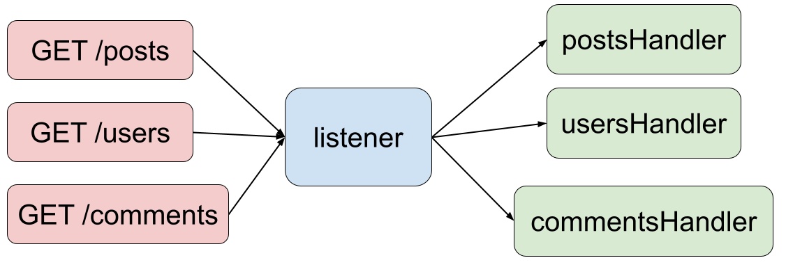

# HTTP Server + Routing

## Q: What are the responsibilites of a server?

- ...
- ...
- ...

## NPM Packages

`nodemon` makes `npm start` restart the server when there is a file change

```
npm i -g nodemon
```

## Built-In Packages (Don't need to install)

`http` package for creating an HTTP server
`url` package for parsing URLs (extracting pathname and query parameters)

The pattern here is:
1. Define a listener helper function
2. Create an HTTP server using that helper
3. Start "listening" for incoming requests.

```js
const http = require('http');
const url = require('url');
const host = '127.0.0.1';
const port = 8000;

// This function will handle all incoming requests and generate responses
const requestListener = (req, res) => { 
    console.log(`incoming request at ${req.url}`);
    
    res.writeHead(200, {'Content-Type': 'text/html'});
    res.write("<h1>Welcome to the home page</h1>");
    res.end();
}

// Create a server object with the provided handler
const server = http.createServer(requestListener);

// Start listening at the provided host:port
server.listen(port, host, () => {
    console.log(`Server is running on http://${host}:${port}`);
});
```

* Request Listener with `req` and `res` objects
* The `req` object:
    * `req.url` will hold the request URL. We can parse this to identify the **requested path** and any **query parameters**
* The `res` object:
    * `res.writeHead(200, headers)` to send status code and headers.
        * `"Content-Type"` is automatically detected so you often don't need to include headers.
    * `res.write()` to send data. Can be called multiple times if needed.
    * `end()` to confirm all data has been sent. It MUST be called.
* Server has to **listen** at a particular port
* Once the program starts running, it will continue to run and listen
    * Use <kbd>Ctrl+C</kbd> to end a Node process.

## Design Pattern: Routing / Route Handlers

Our servers are expected to handle requests for multiple URL paths. For example, Instagram might have the following paths:
* `/posts`
* `/posts/:postId`
* `/posts/:postId/comments/:commentId`
* `/users/:userId`

**_Routing_ is the process of taking in requests and determining the proper resource to serve in response.**



The pattern we'll be using looks like this:
* The request listener parses the request for the URL path and then delegates to a **handler** for different **routes**.
* Pass along the `req` and `res` objects to the handlers.

```js
const http = require('http');
const url = require('url');

const port = 8000;
const host = '127.0.0.1';

//////////////////////////////////////
// Handlers
//////////////////////////////////////

const homeHandler = (req, res) => {
    res.writeHead(200);
    res.write("Welcome to the home page");
    res.end();
}

const errorHandler = (req, res) => {
    // we can chain these calls together
    res.writeHead(404).end('Page does not exist');
}

//////////////////////////////////////
// Delegates to handlers
//////////////////////////////////////
const requestListener = (req, res) => {
    
    console.log(`incoming request at ${req.url}`);
    // Parse the request url. We're looking for the pathname
    const baseUrl = url.parse(req.url);
    console.log('baseUrl:', baseUrl);
    
    // Extract just the pathname
    const { pathname } = baseUrl;
    console.log('pathname:', pathname);

    // Delegate to the appropriate route handler
    switch(pathname) {
        case '/':
            return homeHandler(req, res);
        default:
            return errorHandler(req, res);
    }
}

//////////////////////////////////////
// Create the server and listen
//////////////////////////////////////
const server = http.createServer(requestListener);

server.listen(port, host, () => { 
    console.log(`Server is running on http://${host}:${port}`);
})
```

### Extracting Query Params

`url.parse` takes in a second Boolean argument which is used to determine whether or not to parse the query parameters into an object (defaults to `false`).

For example, the url `/hello?name=ben&age=28` will generate a `query` object looking like:

```js
{
    'name': 'ben',
    'age': '28'
}
```

Note that all values are strings.

Let's see what it looks like if we add in a handler for the `/hello` path:

```js
const helloHandler = (req, res) => {
    const parseQueryParams = true;
    const baseUrl = url.parse(req.url, parseQueryParams);
    console.log('baseUrl:', baseUrl);
    
    // We want the query object
    const { query } = baseUrl;
    console.log('query:', query);

    // And we want the name from the query object
    // This is the same as baseUrl.query.name
    const { name } = query;

    const message = `Hello ${name || 'stranger'}!`;
    res.writeHead(201);
    res.write(message);
    res.end();
}
```

## Host & Ports


Host is like our home address.

* `localhost` is a hostname that refers to the current device used to access it. 
* `localhost` is an alias for `127.0.0.1` which is the standard address used. 
* `localhost === 127.0.0.1`

Ports are the "front doors" of our application. (There are are a lot of doors!)

* `:8000` is considered as a different "door" from `:5500`

Which port should you use? It doesn't really matter, but here are some ones that our instructors like to use and some standards that are used:
* `8000` (What I use)
* `4321` (Mike's favorite because its fun)
* `3000` (What other people use)
* `5500` (What other other people use)
* `80` (Standard unencrypted HTTP port)
* `443` (Standard encrypted HTTPS port)

Just pick one that isn't being used! 

> How do you know which ones aren't being used? Your computer will likely tell you if one is currently in use — just use a different one (or kill the process that is currently using that port).