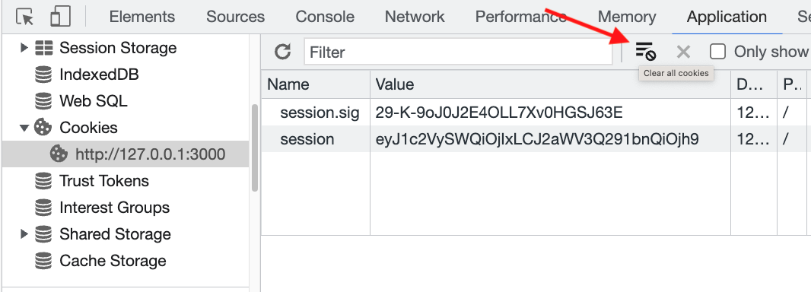

# Auth

**Authentication** and **authorization** are two different concepts related to security and access control. 
* **Authentication** is the process of verifying the identity of a user or entity.
* **Authorization** is the process of determining what resources or actions a user is allowed to access or perform.

## The Template Repo

We are going to be working with [this template repo](https://github.com/The-Marcy-Lab-School/auth-example-bcyrpt-sessions) which will be available for you to use as a starting point for your project. 
* You are NOT expected you to build this from scratch. You are expected to be able to build on top of it.
* It will take time to understand the details. To start, we are hoping for you to understand the high-level picture. To help break it down, consider the 4 main user flows:
  1. Creating a new account
  2. Logging into an existing account
  3. Viewing a home page with information that only logged-in users can see (requires authentication)
  4. Viewing a user profile page where you can update your profile (requires authorization)

## Routes

This auth example uses the following routes defined in `src/routes.js`. In `src/server.js`, we can see that this `Router` is used on all routes starting with `api/`


```js
/* src/server.js */
  const routes = require('./routes.js');
  app.use('/api', routes);

/* src/routes.js */

  // Create
  Router.post('/users', userController.create);
  Router.post('/users/login', userController.login);

  // Read
  Router.get('/users', userController.list);
  Router.get('/users/:id', userController.show);
  Router.get('/me', userController.showMe);

  Router.get('/logged-in-secret', checkAuthentication, (req, res) => {
    res.send({ msg: 'The secret is: there is no secret.' });
  });

  // Update
  Router.patch('/users/:id', checkAuthentication, userController.update);

  // Delete
  Router.delete('/users/logout', userController.logout);

  module.exports = Router;
```

Note that `checkAuthentication` is a middleware function that is manually applied to the `GET /logged-in-secret` and `PATCH /users/:id` routes. 

## Cookies

In the context of computing and the internet, a cookie is a small text file that is sent by a website to your web browser and stored on your computer or mobile device. 

Cookies contain information about your preferences and interactions with the website, such as login information, shopping cart contents, or browsing history.

When you visit the website again, the server retrieves the information from the cookie to personalize your experience and provide you with relevant content.

> ⚠️ It's worth noting that while cookies are generally harmless and serve useful purposes, they can also be used for malicious purposes such as tracking your personal information or spreading malware.

### The cookie-session package

The `cookie-session` middleware module makes it incredibly easy to use cookies to store information about our user. 

```js
const cookieSession = require('cookie-session');

const Router = express.Router();

Router.use(cookieSession({
  secret: process.env.SESSION_SECRET,
}));
```

> <details>
> <summary>🤔 What is SESSION_SECRET?</summary>
> 
> The `SESSION_SECRET` environment variable (see `.env`) is a static sequence of characters that only the server has access to (that's the point of environment variables after all). 
> 
> When the cookie `session` object is created by the server and sent back to the client, we will attach data to that object. We don't want that data to be easily readable so it is encoded using a hashing function. The `SESSION_SECRET` is used like a salt to transform the `session` data into an unreadable string. 
> 
> This value could be generated by mashing your keys, or it could be generated using a service like https://randomkeygen.com/. More secure applications would likely generate a new `SESSION_SECRET` value periodically to reduce the risk that the secret is spilled.
> </details>

With this middleware, all incoming Request objects will have a `req.session` property. We can add whatever data we want to it!

For example, let's put a `viewCount` on the `req.session` and increment it each time the user visits `/api/cookieCounter`. 

```js
Router.get('/cookieCounter', (req, res) => {
  const { session } = req;
  console.log(session); // an empty object at first
  session.viewCount = (session.viewCount || 0) + 1;
  console.log(session.viewCount);
  res.status(200).send({ count: session.viewCount });
});
```

Open the dev tools > Applications > Cookies to see the cookie. The `session` value is the encoded `session` data that we sent over from the server (see it change as the view count increases).



Delete the cookie and then refresh the page. You'll see that the `req.session.viewCount` has been reset!

### Storing User IDs on the Cookie for Authentication

In our application, we are using cookies to store the `userId` of the currently logged-in user on the `req.session` object. This will allow us to implement **authentication** (confirm that the user is logged in).

The flow of cookie data looks like this:


## Fetch Logged-In User

The first user-flow we are going to look at to demonstrate how cookies are used is seeing if a user is already logged in.

In the UI, an authenticated user will see the <kbd>Profile</kbd> button in the navigation bar while an un-authenticated user will see the <kbd>Sign Up</kbd> and <kbd>Login</kbd> buttons.

Files Involved:
* **public/scripts/index.js** (invokes **global.js** functions `fetchLoggedInUser`)
* **public/scripts/global.js** (sends a `GET /api/me` request)
* **src/routes.js** (passes control to `userController.showMe`)
* **src/controllers/user/show-me.js** (checks the `session.userId`, finds the `user` (if present), and returns it)
* **src/db/models/user.js** (finds and returns the `user` from the DB)

If at the end of this process the client receives back the `user`, then the `setNav` function sets the navigation bar to show the <kbd>Profile</kbd> page. If not, then the <kbd>Sign Up</kbd> and <kbd>Login</kbd> buttons are shown instead.

All of the pages use this `fetchLoggedInUser` function to make some modification to the UI shown to the user. Explore how each page does it!

## Logging In

A user can log in when they visit the `/login.html` page using the provided form. 

Starting in the `main()` function of the `public/scripts/login.js` file, if the user is already logged in (using the `fetchLoggedInUser` function), they will immediately be redirected to the `/user.html` page

Files Involved:
* **public/scripts/login.js** (invokes **global.js** methods `signupAndLoginHandler` when the form is submitted)
* **public/scripts/global.js** (sends a `POST /api/users/login` request)
* **src/routes.js** (passes control to `userController.login`)
* **src/controllers/user/login.js** (finds the user by username, checks if the password is correct, sets the `session.userId`, and sends the `user` to the client)
* **src/db/models/user.js** (finds and returns the `user` from the DB and verifies the password with `authUtils.isValidPassword`)
* **src/utils/auth-utils.js** (uses the `bcrypt.compare` method to compare the plaintext password with the hashed password)

If at the end of this process the client receives back a response without any errors, the user has successfully logged in and is redirected to `/user.html`.

## Creating an Account

A user can create an account when they visit the `/create.html` page using the provided form. 

Starting in the `main()` function of the `public/scripts/create.js` file, if the user is already logged in (using the `fetchLoggedInUser` function), they will immediately be redirected to the `/user.html` page

Files Involved:
* **public/scripts/create.js** (invokes **global.js** methods `signupAndLoginHandler` when the form is submitted)
* **public/scripts/global.js** (sends a `POST /api/users` request)
* **src/routes.js** (passes control to `userController.create`)
* **src/controllers/user/create.js** (uses the `User.create` method and sets the `session.userId`)
* **src/db/models/user.js** (uses the `authUtils.hashPassword` method and inserts the username and hashed password into the database)
* **src/utils/auth-utils.js** (uses the `bcrypt.hash` method to convert the plaintext password into a hashed password)

If at the end of this process the client receives back a response without any errors, the user has successfully logged in and is redirected to `/user.html`.

## The User Page

The `/users.html` page handles two key features: updating a username and logging out. For each of these features, there is a form
* `<form id="username-form">`
* `<form id="logout-form">`

Each form is given an event handler in `main` function of the `public/scripts/user.js` file.

### Updating a Username

1. The `public/scripts/user.js` executes the `main` function.
2. Assuming a user is already logged in, the `fetchLoggedInUser` function returns a `user` object which has the `user.id` property. That value is added to the `dataset` field of the form, storing the user's id directly on the HTML form.
    * You can see this if you view the elements of the page. The `<form>` element will have a `data-user-id` attribute.
3. When the form is submitted, control is passed to the `public/scripts/global.js` file's `updateUsernameHandler` function.
4. Using the user id stored on the form, a `PATCH /api/users/${form.dataset.userId}` request is sent to the server (e.g. `PATCH /api/users/5`).
5. The server and router pass control to the `src/controllers/user/update` controller. BUT, before the request gets there, it must pass through the `checkAuthentication` middleware. This middleware behaves exactly like the `show-me` controller. This ensures that only authenticated users can update a user.
6. The `update` controller uses the `isAuthorized` helper function which compares the `userId` value provided as the path parameter (e.g. `/api/users/5`) with the `session.userId` value provided by the cookie. Since the cookie is the source of truth for the user, this guarantees that the user making the request is the same user as the user specified by the path to be updated.

### Logging Out

* Logging out is handled by the `public/scripts/global.js` function `logOutHandler` which sends a `DELETE /api/users/logout` request to the server.
* The server and router pass control to the `logout` controller which very simply sets the cookie `session` to `null`, effectively destroying the cookie.
* When the client recieves a response, it immediately redirects the user to the home page `/`. You can confirm that the cookie is gone by checking the developer tools > Application > cookies. 
