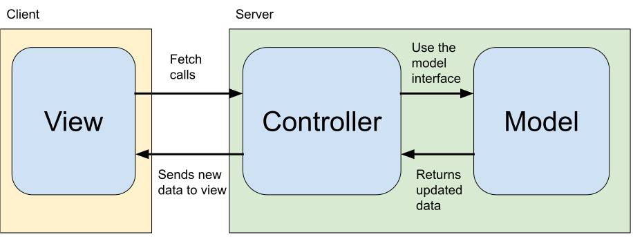
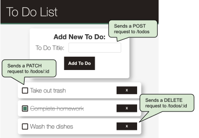
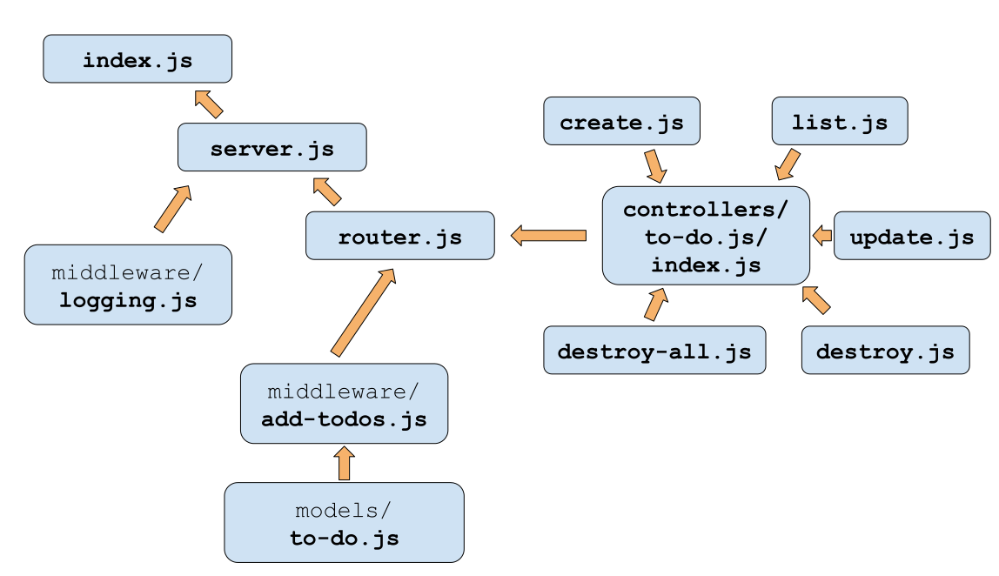

# Organizing a Project with MVC

**MVC (Model-View-Controller)** is a software architecture pattern that divides program logic into three responsibilites:
* **Model**: The application's dynamic data structure, independent of the user interface. Provides an interface for CRUD actions.
* **View**: How the application's model is presented visually to the user. Provides UI components for interacting with the controllers.
* **Controller**: Accepts inputs from the view and uses the model's interface to make changes. Sends back updated model state to update the view.



### Why MVC?

**Q: What design principle does MVC encourage us to follow?**

<details><summary>Answer</summary>
<br>

Separation of concerns

</details>

### MVC with Express

**View**
In an express application, the static assets (HTML, CSS, JS) that are served to the user at the home route `/` provides the view. The view will interact with the controller via `fetch` calls to the specified URL endpoints.



**Controller**
In an Express app, the controllers are the individual route-handlers for each HTTP verb. 

They use the path, dynamic route parameters, query parameters, and data in the request body as inputs to the model's interface. 

They also will create responses to send back to the view.


```js
const getTodosController = (req, res) => {
  const { ToDo } = req;
  const items = ToDo.list();
  res.send(items);
};

module.exports = getTodosController;
```

These will be imported by the server and assigned as request handlers.

**Model**

CRUD (create, read, update, delete) actions lie at the core of any model. Typically, the model is represented with a database. In our applications so far, it has been a `class`. 

In both cases, the model will have a dedicated file with functions for managing the underlying data.

Only the controllers will have access to the model's interface.

### File Structure for ToDo Application



- `public/` **(View)** 
    - `index.html`, `index.css`, `index.js`
- `src/`
    - `controllers/` **(Controller)** 
        - `index.js` (“barrel file” - imports all of the files below)
        - `create.js`, `list.js`, `update.js`, `delete.js`, `delete-all.js` (bonus `find.js`)
    - `middleware/`
        - `add-todos.js`, `log-routes.js`
    - `models/` **(Model)**
        - `todo.js` - defines the `ToDo` model (in-memory array + CRUD actions)
    - `index.js` - entry point, imports the `server`, starts the `server`
    - `server.js` - imports `router`, sets up middleware
    - `routes.js` - imports controllers and defines routes, sets up ToDo middleware
    - `utils.js` - exports id generator function

### Express Router

A Express [router](https://expressjs.com/en/api.html#router) object is an isolated instance of middleware and routes. You can think of it as a “mini-application,” capable only of performing middleware and routing functions. Every Express application has a built-in app router.

A router behaves like middleware itself, so you can use it as an argument to `app.use()` or as the argument to another router’s `use()` method.

The top-level `express` object has a `Router()` method that creates a new router object.

Once you’ve created a router object, you can add middleware and HTTP method routes (such as `get`, `put`, `post`, and so on) to it just like an application. For example:

```js
// invoked for any requests passed to this router
router.use((req, res, next) => {
  // .. some logic here .. like any other middleware
  next()
})

// will handle any request that ends in /events
// depends on where the router is "use()'d"
router.get('/events', function (req, res, next) {
  // ..
})
```

You can then use a router for a particular root URL in this way separating your routes into files or even mini-apps.

```js
// only requests to /calendar/* will be sent to our "router"
app.use('/calendar', router);
```

**Q: What URL paths will be handled by the `get` handler in the first code snippet above?**

<details><summary>Answer</summary>
<br>

`/calendar/events`

</details>

### Summary

* MVC stands for **M**odel **V**iew **C**ontroller and it is a _software architecture pattern_.
* MVC promotes separation of concern
* The view renders the current state of the model and provides a UI for interacting with the model via the controllers
* The controllers take inputs from the view and use them to call on the models interface. Then, it takes the updated model and sends new data to the view.
* The model is the dynamic data structure that is independent from the UI. It creates an interface that controllers can use to manage the data.
* The Express `router` object lets us break up the routes in our application into "mini" applications for particular sub-routes.
* In Express, we can organize our code with the following file structure:
  * `index.js`
  * `server.js`
  * `router.js`
  * `controllers/`
    * `featureA/` (with a barrel file)
    * `featureB/` (with a barrel file)
  * `models/`
    * `featureA.js`
    * `featureB.js`
  * `middleware/`
  