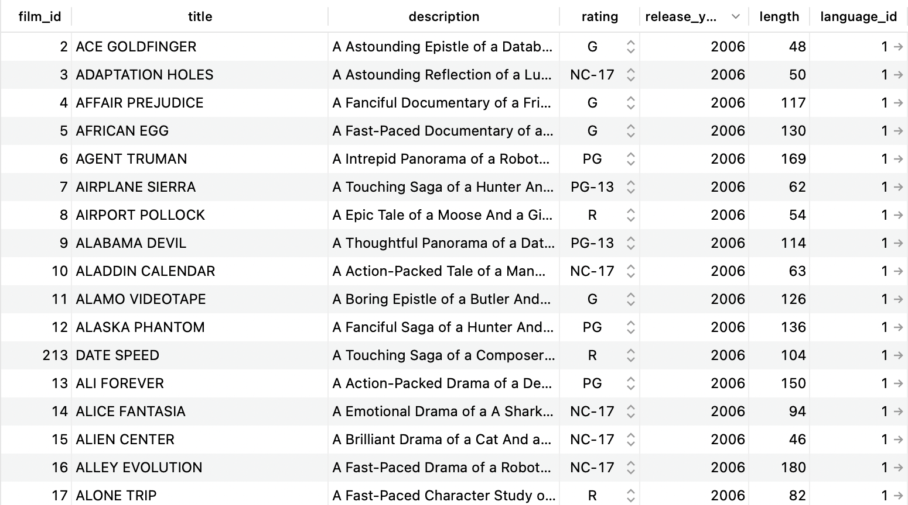
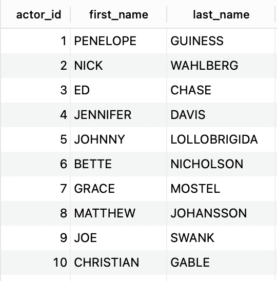
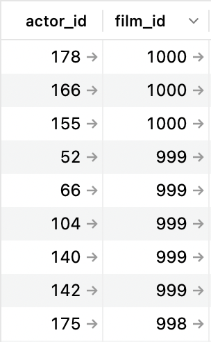
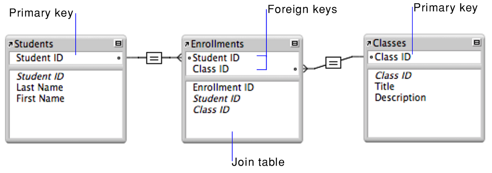

# SQL & Databases

**Agenda**
- [What is a database?](#what-is-a-database?)
  - [What is a relational database](#what-is-a-relational-database)
  - [Entity Relation Diagrams](#entity-relation-diagrams)
- [What is SQL?](#what-is-sql)
  - [Tips to avoid errors](#tips-to-avoid-errors)
- [Using PostgreSQL and SQL](#using-postgresql-and-sql)
  - [Connecting to PSQL and Creating a DB](#connecting-to-psql-and-creating-a-db)
  - [Managing Tables](#managing-tables)
  - [CRUD Actions within a Table](#crud-actions-within-a-table)
    - [Create - Adding Values to a Table](#create---adding-values-to-a-table)
    - [Read - Getting Values From a Table](#read---getting-values-from-a-table)
    - [Update - Modify Existing Rows](#update---modify-existing-rows)
    - [Delete - Deleting Existing Rows](#delete---deleting-existing-rows)

### What is a database?

A database is a structured collection of data.

Database management systems (DBMSs) provide the tools for managing, querying, and analyzing data stored in the database.

PostgreSQL is a popular **DBMS**.



A PostgreSQL database stores collections of data called **tables**. Above is an example of a table called `film`.

Each table is made up of **rows** and **columns**.
* Each row represents a single object/instance/record in the table 
* Each column represents a property/attribute/field of that object. Columns have data types such as integer, string, date, or boolean.

### What is a relational database?

PostgreSQL is an **object-relational DBMS**, meaning that in addition to storing its data as objects, it allows for relationships between objects across tables.

Here is another table in the same database called `actor`:



Every table has a column that serves as the **primary key**, a unique value assigned to each row in the table. 

> **Q: What is the primary key in the tables above?**
> 
> <details><summary>Answer</summary>
> <br>
>
> `actor_id` is the primary key for the `actor` table. `film_id` is thep primary key for the `film` table.
> 
> </details>

Relationshps can be established between two tables through a **join table**. This table is called `film_actor`:



When the primary keys of another table are used in a join table, they are called **foreign keys**.

> **Q: I want to know what movie `actor_id = 3` is in. How would I find it?**
> 
> <details><summary>Answer</summary>
> 
> 1. Look at the `film_actor` table and find the row where `actor_id = 3`. 
> 2. Take note of the `film_id`. 
> 3. Then, in the `film` table, find the row with the `film_id` you found earlier. 
> 4. Then look at the `title` column!
> 
> </details>

### Entity Relation Diagrams

An **Entity Relation Diagram (ERD)** illistrates the properties of tables (a.k.a. "entities") and their relationships with other tables/entities.



## What is SQL?

SQL (Structured Querying Language) is the language used by many relational DBMSs to create, modify, and retrieve data.

SQL is written in statements that are composed of **keywords** and **clauses**.

```sql
SELECT actor_id, first_name 
FROM actor
WHERE last_name = 'DAVIS';
```

Keywords determine the operation to be performed. Clauses modify the operation.

* Common keywords: `SELECT`, `FROM`, `INSERT INTO`, `UPDATE`, `DELETE`
* Common clauses: `WHERE`, `GROUP BY`, `ORDER BY`

Statements can also include **functions**, **operators**, and **identifiers**.

> **Q: What does the query above look for?**
> 
> <details><summary>Answer</summary>
> 
> The first names of actors who have the last name 'DAVIS'
> 
> </details>

### Tips to avoid errors
* SQL is NOT case sensitive. However, it is a standard practice to write keywords in all-caps to distinguish them from values.
* SQL strings MUST be written with single quotes `''` to avoid unwanted errors.
* SQL queries MUST end in a semicolon `;` to avoid unwanted errors.


---

## Using PostgreSQL and SQL Examples

For practice, [follow along with these instructions](./practice/README.md).

### Connecting to PSQL and Creating a DB

- Go to the command line and connect to your database by running the command `psql`.
  - Now you are connected to PostgreSQL!
  - To exit from PostgreSQL, use `control d`.
- Run the command `\l` within your `psql` command line to see existing databases.

- Create a database called `marcy` by running the command `CREATE DATABASE marcy;`
  - **NOTE** the semi-colon is important for ending the execution of this command! Makes sure to include it.
  - You have successfully created a database if your `psql` command line outputs `CREATE DATABASE`.
- Next, connect to your database by running the command `\c marcy`. 
  - Successfully connecting to your database will output `You are now connected to database "marcy" as user "[your username]"`.

### Managing Tables 

Creating a Table

```sql
CREATE TABLE lessons(
  id SERIAL PRIMARY KEY, 
  title TEXT NOT NULL, 
  instructor TEXT NOT NULL
);
```

Dropping a Table

```sql
DROP TABLE lessons;
```

### CRUD Actions within a Table

##### Create - Adding Values to a Table

```sql
INSERT INTO lessons 
VALUES(1, 'data structures', 'ben');
```

#### Read - Getting Values From a Table

Get specific columns from a table with `SELECT column FROM table`:
```sql
SELECT title, instructor
FROM lessons;
```

Get all columns from a table with `SELECT *`:
```sql
SELECT * 
FROM lessons;
```


Filter the rows with `WHERE`:

```sql
SELECT *
FROM lessons
WHERE instructor='ben';
```

Combine conditions with `AND` or `OR`:

```sql
SELECT *
FROM lessons
WHERE instructor='ben' OR instructor='gonzalo';
```

Renaming queries with `AS`:

```sql
SELECT title AS "Course Title"
FROM lessons;
```

Counting values in the table with `COUNT` (we can also limit the search with `WHERE`):

```sql
SELECT COUNT(*)
FROM lessons
```

Collapsing columns with `GROUP BY`:

```sql
SELECT COUNT(*), instructor 
FROM lessons 
WHERE instructor='ben' 
GROUP BY instructor; 
```

#### Update - Modify Existing Rows

```sql
UPDATE lessons
SET instructor = 'gonzalo'
WHERE title = 'data structures';
```

#### Delete - Deleting Existing Rows

```sql
DELETE FROM lessons
WHERE title = 'data structures';
```
