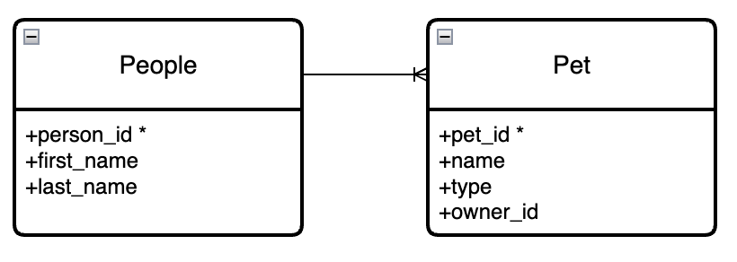

# Relational Queries Activity

### One to Many Relationship

**Setup**

```sql
DROP TABLE IF EXISTS people;
DROP TABLE IF EXISTS pets;

CREATE TABLE people (person_id INTEGER PRIMARY KEY, first_name TEXT, last_name TEXT);
INSERT INTO people (person_id, first_name, last_name) VALUES (1, 'Ann', 'Duong');
INSERT INTO people (person_id, first_name, last_name) VALUES (2, 'Reuben', 'Ogbonna');
INSERT INTO people (person_id, first_name, last_name) VALUES (3, 'Maya', 'Bhattacharjee');

CREATE TABLE pets (pet_id INTEGER PRIMARY KEY, name TEXT, species TEXT, owner_id INTEGER);
INSERT INTO pets (pet_id, name, species, owner_id) VALUES (1, 'Khalo', 'dog', 3);
INSERT INTO pets (pet_id, name, species, owner_id) VALUES (2, 'Juan Pablo', 'dog', 2);
INSERT INTO pets (pet_id, name, species, owner_id) VALUES (3, 'Bora', 'bird', 1);
INSERT INTO pets (pet_id, name, species, owner_id) VALUES (4, 'Tora', 'dog', 1);
INSERT INTO pets (pet_id, name, species, owner_id) VALUES (5, 'Frida', 'cat', 3);
INSERT INTO pets (pet_id, name, species, owner_id) VALUES (6, 'Pon Juablo', 'cat', 2);
INSERT INTO pets (pet_id, name, species, owner_id) VALUES (7, 'Kora', 'cat', 1);
```

**People Table:**
| person_id  | first_name  | last_name     |
| --- | ----------- | ------------- |
| 1   | Ann         | Duong         |
| 2   | Reuben      | Ogbanna       |
| 3   | Maya        | Bhattacharjee |

**Pets Table:**
| pet_id| name        | type | owner_id |
| --| ----------- | ---- | ---------|
| 1 | Khalo       | dog  | 3        |
| 2 | Juan Pablo  | dog  | 2        |
| 3 | Bora        | bird | 1        |
| 4 | Frida       | cat  | 3        |
| 5 | Tora        | dog  | 1        |
| 6 | Pon Juablo  | cat  | 2        |
| 7 | Kora        | cat  | 1        |

**Q: What is the primary key for each table? Are there any foreign keys?**

**Has Many:** We say a person has many pets
**Belongs To:**	We say a pet belongs to a person



#### Simple Queries

- Who are the cats in our database?
- How many cats are in our database?

### Creating a Join Table

How can we create this join table?

| person_id  | first_name  | last_name     | pet_id | name        | type | owner_id |
| --| ----------- | ---- | ---------| --- | ----------- | ------------- |
| 1	 | Ann	Duong | 	3 | 	Bora 	| bird	| 1 | 
| 1	 | Ann	Duong | 	4 | 	Tora 	| dog	| 1 | 
| 1 | 	Ann	Duong | 	7 | 	Kora 	| cat	| 1 | 
| 2 | 	Reuben	Ogbonna | 	2 | 	Juan  Pablo	| dog	| 2 | 
| 2 | 	Reuben	Ogbonna | 	6 | 	Pon  Juablo	| cat	| 2 | 
| 3 | 	Maya	Bhattacharjee | 	1 | 	Khalo 	| dog	| 3 | 
| 3 | 	Maya	Bhattacharjee | 	5 | 	Frida 	| cat	| 3 | 

<details><summary>Answer</summary>

```sql
SELECT * 
	FROM people 
JOIN pets 
	ON people.id = pets.owner_id;
```

</details>

#### Relational Queries:

- What are all the pets owned by Ann?
- Who is the owner of Frida?
- How many people own cats?
- How many pets does Maya have?

```sql
SELECT * 
	FROM people 
JOIN pets 
	ON people.id = pets.owner_id
WHERE 
	people.first_name = 'Ann';
```


### Other Examples

Let's build a `cohort` and `fellows` one-to-many database!
