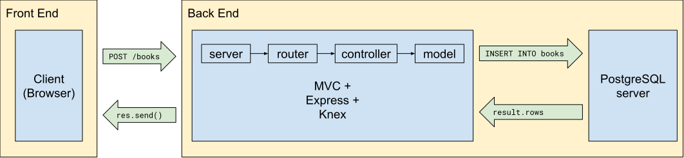
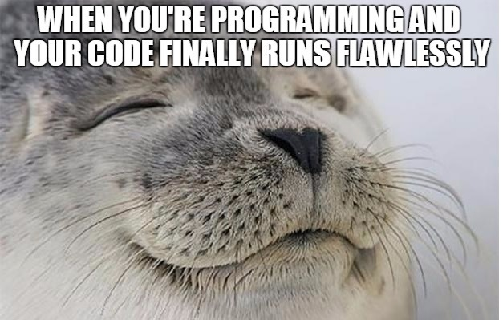

# Books Refactor

In this lecture, we are going to be refactoring a reading list Express application. 

[Click here to clone the repo!](https://github.com/The-Marcy-Lab-School/books-express-no-db/)

Currently, that application's model uses an in-memory array to manage a list of books. As a result, the data will only persist as long as the server is up and running. We will refactor this project using Knex to connect to a PostgreSQL database to manage a **persistent** set of data.



## Setup + File Structure

* Create a database called `books`
* create `src/db` folder
* `npx knex init` 
* Configure the `knexfile.js` (remember to `require('path')`)

```js
const path = require('path');

module.exports = {
  development: {
    client: 'pg',
    connection: {
      database: 'books',
      user:     'benspector',
      password: 'postgres'
    },
    migrations: {
      directory: path.join(__dirname, 'src', 'db', 'migrations')
    },
    seeds: {
      directory: path.join(__dirname, 'src', 'db', 'seeds')
    }
  }
}
```

* `npx knex migrate:make create_books_table`

```js
exports.up = (knex) => {
  return knex.schema.createTable('books', (table) => {
    table.increments('id').primary();
    table.string('title').notNullable();
    table.string('published_year').notNullable();
  });
};

exports.down = (knex) => {
  return knex.schema.dropTable('books');
};
```

* `npx knex migrate:latest`
* `npx knex seed:make seed_books`

```js
exports.seed = async function(knex) {
  // Deletes ALL existing entries
  await knex('books').del()
  await knex('books').insert([
    { title: 'Learn to Git With It',	published_year: 2015 },
    { title: 'HTML for Dummies',	published_year: 2018 },
    { title: 'Advanced JavaScript',	published_year: 2009 },
    { title: 'Starting Express',	published_year: 2010 },
    { title: 'Node for Noobies',	published_year: 2020 }
  ]);
};
```

* `npx knex seed:run`

## Refactoring the Model + Controllers

* move `src/models` folder into `src/db` (update the `src/middleware/add-books` import)
* Test to make sure everything still works!
* create `src/db/models/knex.js` file

```js
const env = 'development';
const config = require('../../../knexfile')[env];
const knex = require('knex')(config);

module.exports = knex;
```

* Update `src/models/books/` to use `knex`
  * We don't need the `static #all` array anymore!
  * Replace array manipulation logic with `knex.raw` queries
  * Remember to use `try/catch`!

Here is an example:

```js
static async list() {
  try {
    const result = await knex.raw(`
      SELECT *
      FROM books;
    `);
    return result.rows;
  } catch (err) {
    console.error(err);
    return null;
  }
}
```

* Update controller functions to use `async` and `await`.
* Instead of using the `Book` constructor, we'll use a `static create` method.
* Update `src/controllers/books/create` to use the `Book.create` method instead of the constructor.

## Celebrate!

