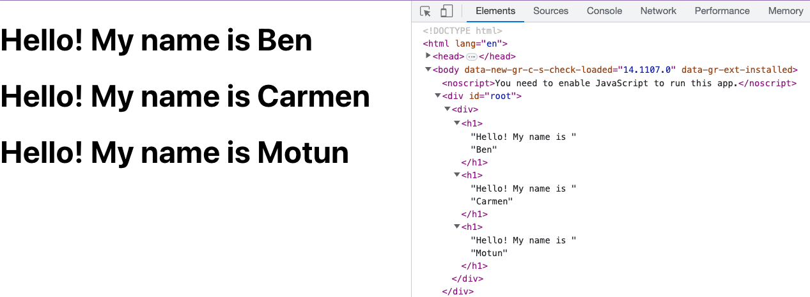
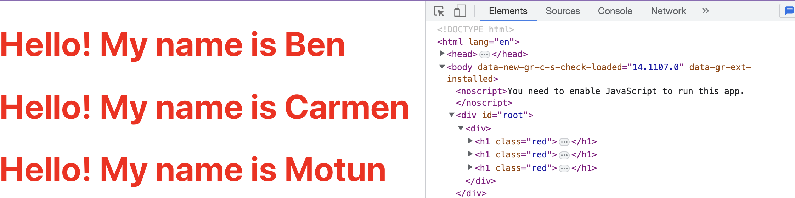

# Intro to React

Key Terms:
* React
* Component
* JSX
* Render
* ReactDom
* ESModule `import` syntax (to import `react` and `react-dom/client`
* injecting JS
* props

```js
import React from 'react'
import ReactDOM from 'react-dom/client'
```

## What is React?

**React** is a JavaScript framework for building user-interfaces. 

React focuses on building small **components** that can be composed into larger components. 

Components can be reused and generated dynamically, allowing developers to build applications at scale efficiently.

## Why Use React?

It is fast and lets us use JSX to intuitively build UIs.

Vanilla JS with the DOM API (imperative style):

```js
const makeHeader = (message) => {
  const h1 = document.createElement('h1');
  h1.className = 'header';
  h1.innerText = message;
  return h1;
}
```

React (declarative style):

```jsx
const Header = ({ message }) => {
  return (
    <h1 className='header'>{message}</h1>
  )
}
```

## Components & JSX

In React, a **component** is a piece of __reusable__ code that represents a part of a user interface. 

React uses JSX, an HTML-like syntax that can be written in JS files, to create React components.

Components in React are functions that return a single JSX element:

```jsx
const Header = () => {
  return <h1>Hello World</h1>;
}
```
* This `Header` component returns a `<h1>` _JSX element_.
* Component names are capitalized

## Component Composition

Components can return as much (or as little) JSX as you want, **but they all need to return a single surrounding element.** An easy way to achieve this is by using **fragments** (`<> </>`) or just use a `<div>`

```jsx
function Header() {
  return <h1>Hello World</h1>;
}

function InstagramPost() {
  return (
    <div>
      
      <p>Check out my cute cat!</p>
    </div>
  );
}

function App() {
  return ( 
    <div>
      <Header />
      <InstagramPost />
    </div>
  )
}
```

* Note how our custom `<Header />` and `<InstagramPost />` components are used within the `App` component. Custom components _must_ be self-closed.

## Rendering Components

To make our components visible in our UI, we need to **render** them. React doesn't provide this functionality out of the box. Instead, we import a package called `ReactDOM`. We're using the `client` version (there is also a `native` version for mobile).

```jsx
import ReactDOM from 'react-dom/client'

const Header = () => {
  return (
    <h1>Hello World</h1>
  )
}

// It is a best practice to bundle all components in a top-level App component.
const App = () => {
  return (
    <>
      <Header />
      <Header />
      <Header />
    </>
  )
}

ReactDOM.createRoot(document.getElementById('root')).render(
<App />);
```

React code cannot simply be loaded into an HTML file. It must first be **compiled** (converted to vanilla JS).

We're using a tool called Vite (french for "quick", rhymes with "feet") to do that compilation and serve our website.

Use the `npm run dev` command to start the React development server.

* The React development server 

## Injecting JavaScript Values

We can inject JavaScript values into our components using `{}`. 

```jsx
// We can inject these JS values into JSX
const catName = 'Tom';
const catPicUrl = './img/cat-pic.jpg'

function InstagramPost() {
  return (
    <div>
      
      <p>Check out my cute cat named ${catName}!</p>
    </div>
  );
}
```

## Props

Every React function-component is passed an argument called `props`. It is an object containing properties provided to the component by the parent.

In this example, the parent component is `App` and it provides a `name` prop to each instance of the `NameHeader` component.

```jsx
import React from 'react';

function NameHeader(props) {
  const { name } = props;
  return (
    <h1>Hello! My name is {name}</h1>
  )
}

export default function App() {
  return (
    <NameHeader name="Ben" />
    <NameHeader name="Carmen" />
    <NameHeader name="Motun" />
  )
}
```

Which renders...



The `props` parameter will *always* be an object so it is often destructured immediately within the parameter list:

```jsx
function NameHeader({ name }) {
  return (
    <h1>Hello! My name is {name}</h1>
  );
}
```

## Adding Style

We can add style by using the `className` prop and defining styles for that class in an imported CSS file.

```jsx
import React from 'react';
import './styles/styles.css'

function NameHeader({ name }) {
  return (
    <h1 className='red'>Hello! My name is {name}</h1>
  )
}

export default function App() {
  return (
    <div>
      <NameHeader name="Ben" />
      <NameHeader name="Carmen" />
      <NameHeader name="Motun" />
    </div>
  )
}
```

With this CSS in a `styles/styles.css` file:

```css
.red {
  color: red;
}
```

Which will render this...

