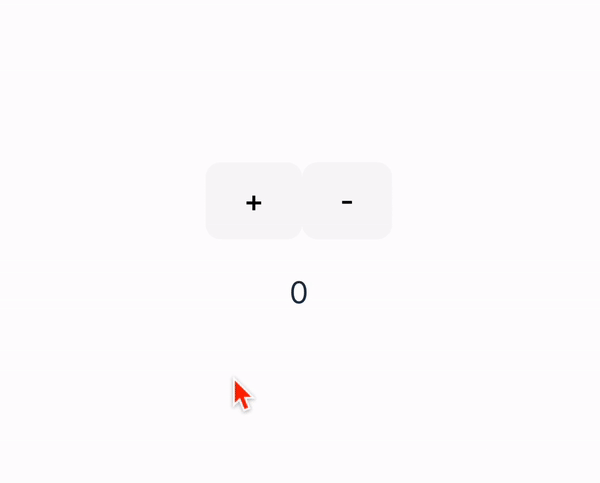
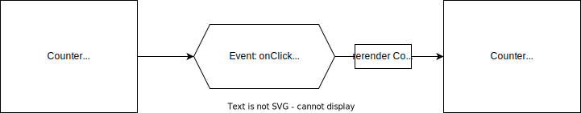
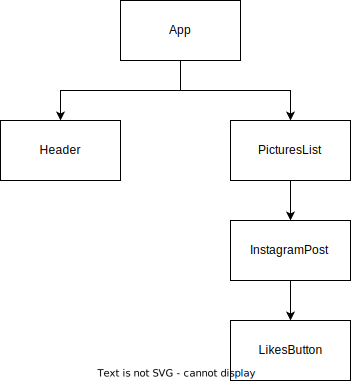
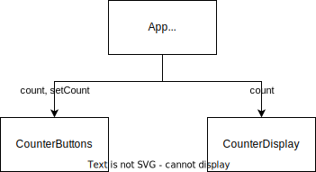

# Managing State

Key Terms

- Props
- `useState`
- `onClick` event handlers
- Lifting state up

## onClick handlers

Imagine building the most basic example of all time - a counter.



The application is simple, it has two buttons to increment a counter and a display element to show the current value.

For now lets focus on a single button.

Maybe the code could look like this?

```jsx
const Counter = () => {
  let count = 0;

  const incrementCount = () => {
    count++;
    console.log(count);
  };

  return (
    <>
      <button onClick={incrementCount}>+</button>
      <p>{count}</p>
    </>
  );
};

export default Counter;
```

When we open up the console, we can see that the value of `count` is in fact changing. But the UI isn't! Why not?

**We haven't told our UI to update.** We _could_ insert some vanilla JS like this:

```js
document.querySelector("p").innerText = count;
```

But that isn't very React-ey.

## Use State

What we want is to make our component **stateful**: we want our `Counter` to be able to keep track of the `count`.

In React, we can achieve this using the `useState` function from the `react` package.

##### Import useState from react

```jsx
import { useState } from "react";
```

- `useState` is a _named export_ of the `react` package (note the `{}` around the function in the `import` statement).

##### Invoke useState at the top of your component

```jsx
const Counter = () => {
  const [count, setCount] = useState(0);

  //...
};
```

- `useState` _must_ be called at the top of a component. [Otherwise weird stuff happens](https://legacy.reactjs.org/docs/hooks-rules.html).

- Invoking `useState` returns an array with two values:

  1. A piece of state data (`count`) with a starting value (`0`)
  2. A "setter" function for updating that state data (`setCount`)

- We use _array destructuring_ to create variables for each value (`count` and `setCount`).

##### Use the setter function to update the state

```jsx
const incrementCount = () => {
  setCount(count + 1); // Do this
  count++; // Don't do this
};
```

- `setCount` is invoked to update the value of `count`. We can use the current value of `count` to calculate its next value.
- NEVER directly modify the value of a piece of state (`count++`) or unexpected behavior will occur.

##### Attach the event handler and render the state

```jsx
return (
  <>
    <button onClick={incrementCount}>+</button>
    <p>{count}</p>
  </>
);
```

- When the button is clicked and we invoke the setter function (`setCount`), **React will detect the change and automatically re-render the component with the new state.**

##### All Together Now

```jsx
import { useState } from "react";

const Counter = () => {
  const [count, setCount] = useState(0);

  const incrementCount = () => {
    setCount(count + 1);
  };

  return (
    <>
      <button onClick={incrementCount}>+</button>
      <p>{count}</p>
    </>
  );
};

export default Counter;
```

**Important Concept**: `setCount` does NOT change the value of `count`. It tells React to re-render the `Counter` component with a new value of `count`.



You can see this if you place a `console.log(count)` statement inside of `incrementCount` and then move it to inside of the component itself (after `useState`).

### Instapets Code Break: Lifting State Up



1. Implement a `LikesButton` component rendered by each `InstagramPost`
2. Use state for each button

---

## Lifting State Up

Suppose we wanted to divide our application's UI into two parts: `CounterButtons` and `CounterDisplay`.

There is one problem: **where should we define the state**?

`CounterDisplay` needs to know the value of `count` AND `CounterButtons` needs to be able to access both `setCount` and `count`.



In these circumstances, we can "lift up" the state value to the shared ancestor component. Then, we pass the state value and setter function down as props.

```jsx
import CounterButtons from "./components/CounterButtons";
import CounterDisplay from "./components/CounterDisplay";

const App = () => {
  const [count, setCount] = useState(0);

  return (
    <>
      <CounterButtons count={count} setCount={setCount} />
      <CounterDisplay count={count} />
    </>
  );
};

export default App;
```

<details><summary>See the <code>CounterButtons</code> component</summary>

```jsx
const CounterButtons = ({ count, setCount }) => {
  const increment = () => setCount(count + 1);
  const decrement = () => setCount(count - 1);

  return (
    <>
      <button onClick={increment}>+</button>
      <button onClick={decrement}>-</button>
    </>
  );
};

export default CounterButtons;
```

</details>

<details><summary>See the <code>CounterDisplay</code> component</summary>

```jsx
const CounterDisplay = ({ count }) => {
  return <p>{count}</p>;
};

export default CounterDisplay;
```

</details><br>

**Important Concept**: The `count` and `setCount` values are tied to the `App` component, where they were created.

Because of this, when `setCount` is invoked it will cause the `App` to re-render, even if the `App` component itself doesn't invoke `setCount`.

### Best Practice: Define _how_ the state can be updated in the same place where the state is created

In the example above, we are passing down the `count` and `setCount` values directly to `CounterButtons`, letting `CounterButtons` decide how it is going to update the sate.

Instead, we may decide to define functions for updating the state in `App` and pass those functions down as props:

```jsx
import CounterButtons from "./components/CounterButtons";
import CounterDisplay from "./components/CounterDisplay";

const App = () => {
  const [count, setCount] = useState(0);

  // define how to update the count here, not in the child component
  const increment = () => setCount(count + 1);
  const decrement = () => setCount(count - 1);

  return (
    <>
      <CounterButtons increment={increment} decrement={decrement} />
      <CounterDisplay count={count} />
    </>
  );
};

export default App;
```

<details><summary>See the updated <code>CounterButtons</code> component</summary>

```jsx
const CounterButtons = ({ increment, decrement }) => {
  return (
    <>
      <button onClick={increment}>+</button>
      <button onClick={decrement}>-</button>
    </>
  );
};

export default CounterButtons;
```

</details><br>

**Q: What are the benefits of doing this?**

<details><summary>Ben's Answer</summary><br>

> I think the main benefit of this is that it also keeps all of the logic related to managing the `count` state in one place. Think MVC.
>
> The result is that both the `CounterButtons` and `CounterDisplay` components are blissfully un-aware of the state values themselves. They are simply told what value to display (`count`) or what to do when the buttons are clicked (`increment` or `decrement`).

</details>

### Instapets Code Break: Lifting State Up

Keep a `totalLikes` piece of state displayed in the header that shows the sum of all likes.
