# useEffect

## What exactly is a hook?

We've already learned about `useState`. Did you know that this function is called a **hook**?

React has many more **hook** functions:

- `useEffect`
- `useContext`
- `useReducer`
- `useMemo`
- `useRef`
- and more...

You may already be seeing a pattern - **hook functions all start with the word `use`**! That's a helpful pattern to easily identify a hook function.

Hooks are a deep topic that you can dive into if you really want to understand how they work under the hood. But the short of it is that **hooks allow us to control how our components interact with React's re-rendering features.**

Let's learn about the second most important hook after `useState`: `useEffect`.

## useEffect

`useEffect` allows our React components to execute "code that produces side effects". We can think of this as **anything that happens outside of React**.

For example: directly modifying the DOM.

In the example below, we have a piece of state called `count` and we are using that value to dynamically update the `document.title`. React is not in the business of direct DOM manipulation, so we create an _effect_.

```jsx
import { useState, useEffect } from "react";

function Counter() {
  const [count, setCount] = useState(0);

  useEffect(() => {
    document.title = count; // the effect
  }, [count]); // the dependencies

  return (
    <>
      <button onClick={() => setCount(count + 1)}>+</button>
      <p>{count}</p>
    </>
  );
}
```



### Break It Down

Let's look at the steps involved to dynamically update the `document.title`.

##### 1. Import the useEffect hook

```jsx
import { useEffect } from "react"; // when importing alone
import { useState, useEffect } from "react"; // when importing alongside other named exports
```

- `useEffect` is a _named export_ of the `react` package, just like `useState`.

##### 2. Invoke `useEffect` at the TOP of your component with your other hooks.

```jsx
import { useState, useEffect } from "react";
const Counter = () => {
  const [count, setCount] = useState(0);

  useEffect(() => {
    document.title = count;
  }, [count]); // re-execute the effect whenever count changes

  // ...
};
```

- `useEffect` takes in two arguments
  1. a callback function to execute when the component is first rendered
  2. (optional) an array of state values to track (a "dependency array").
- If the dependency array is provided, the effect will be only be re-executed on future re-renders if any of those state values are updated.

##### 3. Determine your dependency array

```jsx
useEffect(() => {
  document.title = count;
}, []); // only execute the effect once

useEffect(() => {
  document.title = count;
}); // execute after EVERY re-render
```

- If the array is empty, the effect is only executed on the first render of the component.
- If the array is omitted, the effect is executed on EVERY render of the component.

---

## Fetching with useEffect

[Get the code!](https://github.com/The-Marcy-Lab-School/react-useEffect-fetch-example)

When we want to fetch data from an API (a public one or our own API), we will put that fetching logic into a `useEffect` callback.

**Review: how to fetch**

```js
// the function is async so it returns a promise too
const fetchData = async (url) => {
  try {
    const response = await fetch(url); // use fetch
    const data = await response.json(); // convert incoming json data to js object
    return data; // return that data
  } catch (error) {
    console.log(error);
    return null;
  }
};

const doFetch = async () => {
  const data = await fetchData("https://v2.jokeapi.dev/joke/Any");
  if (data) {
    console.log(data.setup); // the setup
    console.log(data.delivery); // the punchline
  }
};

doFetch();
```

In the example, we're using the [joke API](https://sv443.net/jokeapi/v2/). When a joke is request, an object is returned with a `setup` ("what do you call a...?") and a `delivery` (the punchline).

In our application, we can render that joke like this:

```jsx
// lets start with a hard-coded joke
const joke = {
  setup: "What do you call a pile of cats?",
  delivery: "A meowntain",
};

function App() {
  return (
    <>
      <div className="joke">
        <h1>{joke.setup}</h1>
        <p>{joke.delivery}</p>
      </div>
    </>
  );
}
```

If we want the `joke` to be set by our fetch call, we need to first use `useState`:

```jsx
function App() {
  const [joke, setJoke] = useState({ delivery: "", setup: "" });

  return (
    <>
      <div className="joke">
        <h1>{joke.setup}</h1>
        <p>{joke.delivery}</p>
      </div>
    </>
  );
}
```

Now, let's fetch the joke using the API and `useEffect`:

```jsx
function App() {
  const [joke, setJoke] = useState({ delivery: "", setup: "" });

  useEffect(() => {
    // 1. React wants us to define this function rather than call async code directly
    const doFetch = async () => {
      const responseData = await fetchData("https://v2.jokeapi.dev/joke/Any");
      if (responseData) {
        const { delivery, setup } = responseData;
        setJoke({ delivery, setup });
      }
    };

    // 2. Call the function immediately
    doFetch();
  }, []); // run the effect once

  return (
    <>
      <div className="joke">
        <h1>{joke.setup}</h1>
        <p>{joke.delivery}</p>
      </div>
    </>
  );
}
```

### Using a form to trigger the effect

```jsx
function App() {
  const [query, setQuery] = useState("");
  const [joke, setJoke] = useState({ delivery: "", setup: "" });

  useEffect(() => {
    const doFetch = async () => {
      const url = getApiUrl(query);
      const { delivery, setup } = await fetchData(url);
      setJoke({ delivery, setup });
    };
    doFetch();
  }, [query]);

  return (
    <>
      <form>
        <input
          onChange={(e) => setQuery(e.target.value)}
          type="text"
          placeholder="query"
          value={query}
        ></input>
        <input type="submit" value="submit"></input>
      </form>

      <div className="results">
        <h1>{joke.setup}</h1>
        <details>
          <summary>Reveal</summary>

          <p>{joke.delivery}</p>
        </details>
      </div>
    </>
  );
}
```
