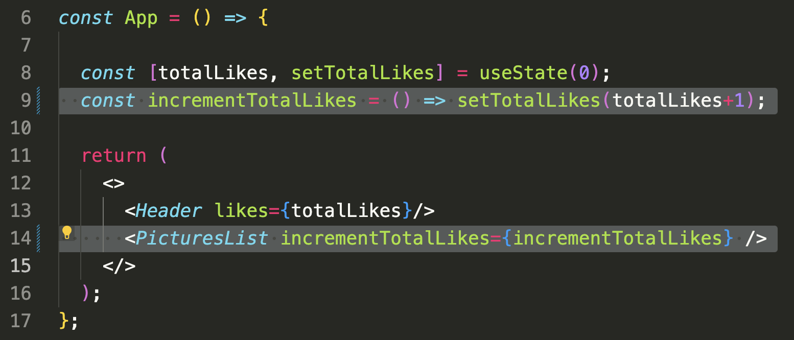
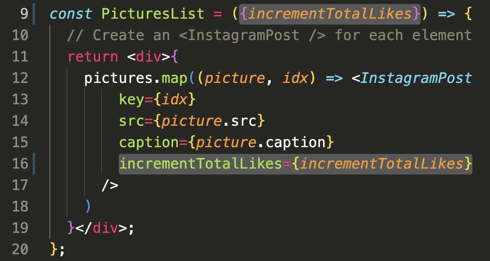
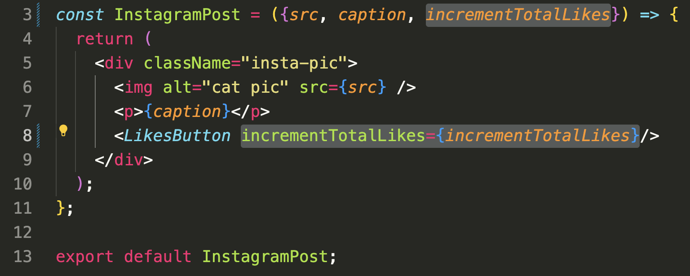
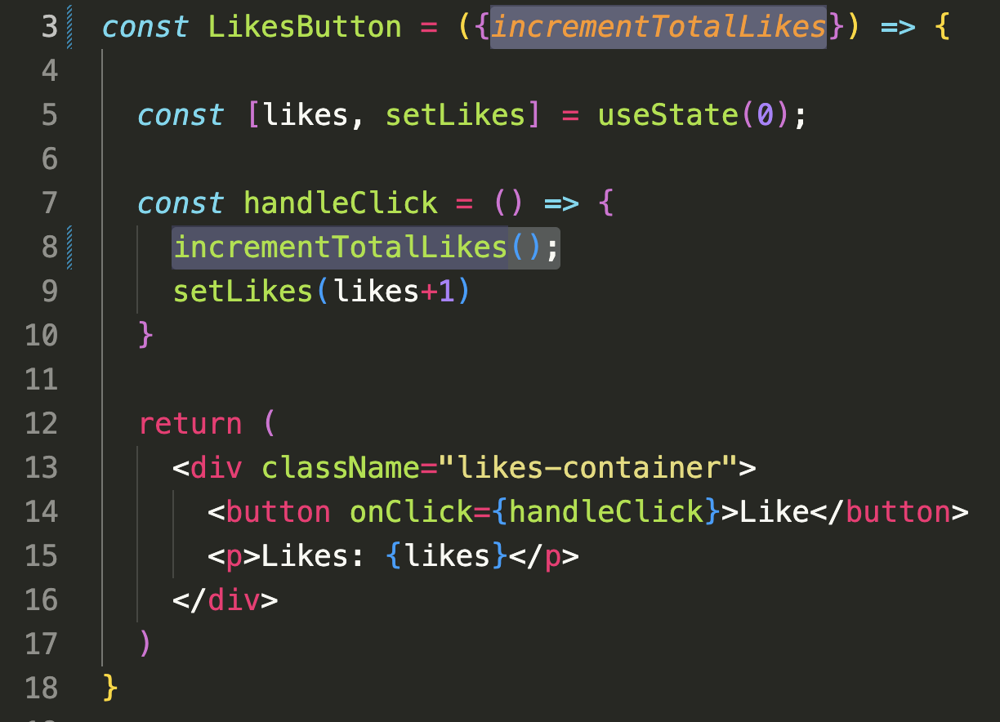

# Context

## Problem: Props Drilling

Consider the instagram clone app that renders something like this:

> Note how there is a **total tally** of likes at the top that sums the likes on each individual picture.

<div style="display: flex; gap:1rem">
  
  
</div><br>

### Passing State From App to LikesButton

To achieve the `totalLikes` feature, The `App` component defines a piece of state called `totalLikes` and a function `incrementTotalLikes` that invokes `setTotalLikes`.

The problem is that the component that uses `incrementTotalLikes` is `LikesButton` which is 3 layers away from `App`. So we first pass it to `PicturesList`...



Which passes it to each `InstagramPost` instance...



Which passes it down to `LikesButton`...



Which finally uses it.



This act of passing a piece of state through multiple intermediate components that don't use that state is called **props drilling**.

It isn't _always_ an issue but at about 3 layers, it starts to feel tedious.

## Solution: useContext

The solution is to create something called a **Context**. Think of Context as an object where we can store global data and that any component within that context's scope can access that data.


To use React's Context API, there are **3 concepts to understand**.

- Making a Context object - `const Context = createContext()`
- Rendering a Context Provider - `<Context.Provider values={} />`
- Getting values from a Context - `useContext()`

### 1. Create a context object

This is certainly the simplest step. It will almost always look like this:

```jsx
// src/context/InstagramContext.jsx
import { createContext } from "react";

const InstagramContext = createContext();

export default InstagramContext;
```

- We create a new folder called `context/` in our `src` folder
- `createContext` is a named export of the `react` library
- We invoke `createContext` to create a new `InstagramContext` object which we export.

### 2. Render a Context Provider

The main reason why we create a `InstagramContext` object is because it has a `.Provider` property that we want to use.

`InstagramContext.Provider` is a React component that we wrap around a portion that we want to give access to the Context (we can even wrap it around the entire `App` if we wanted to).

Below, we wrap the `InstagramContext.Provider` around the `PicturesList` component, giving it and all of its descendants access to the `incrementTotalLikes` function:

```jsx
import "./App.css";
import Header from "./components/Header";
import PicturesList from "./components/PicturesList";
import { useState } from "react";
import InstagramContext from "./context/InstagramContext";

const App = () => {
  const [totalLikes, setTotalLikes] = useState(0);
  const incrementTotalLikes = () => setTotalLikes(totalLikes + 1);

  return (
    <>
      <Header likes={totalLikes} />
      <InstagramContext.Provider value={incrementTotalLikes}>
        <PicturesList />
      </InstagramContext.Provider>
    </>
  );
};

export default App;
```

- We first import the `InstagramContext` we just created.
- `InstagramContext.Provider` is a component that we can wrap around any piece of the application that we want to have access to the context data.
- The `value` prop of the `InstagramContext.Provider` determines the data available to the children of the `InstagramContext.Provider`
- Now, we can safely remove the `incrementTotalLikes` prop from the `PicturesList` and all intermediate components.

### 3. Use the Context

Any component that is a descendant from a `InstagramContext.Provider` may utilize the `value` of that provider using the `useContext` hook from `react`:

```jsx
import { useState, useContext } from "react";
import InstagramContext from "../context/InstagramContext";

const LikesButton = () => {
  const [likes, setLikes] = useState(0);
  const incrementTotalLikes = useContext(InstagramContext);

  const handleClick = () => {
    incrementTotalLikes();
    setLikes(likes + 1);
  };

  return (
    <div className="likes-container">
      <button onClick={handleClick}>Like</button>
      <p>Likes: {likes}</p>
    </div>
  );
};

export default LikesButton;
```

- `useContext` is imported from `react` alongside `useState`
- The `InstagramContext` itself is also imported. This will be needed when we invoke `useContext`
- `useContext` is invoked at the top of the `LikesButton` component. It takes in a `Context` object and returns the `value` prop of the associated `InstagramContext.Provider`.

> We can take this even further and use the Context for every value in the application. However, there is a delicate balance between storing TOO much in context and keeping the state close to the components that need it.

## Summary

Context provides an alternative to **props drilling**.

Think of Context as an object where we can store global data and that any component within that context's scope can access that data.

To use React's Context API, there are **3 concepts to understand**.

- Making a Context object - `const Context = createContext()`
- Rendering a Context Provider - `<Context.Provider values={} />`
- Getting values from a Context - `useContext()`


---

# Context Design Pattern

The illustration above shows how we can **wrap the _entire_ `App` component in our context**, but in the example we only wrap the `PostList` component.

```jsx
import Header from "./components/Header";
import PicturesList from "./components/PicturesList";
import { useState } from "react";
import InstagramContext from "./context/InstagramContext";

const App = () => {
  const [totalLikes, setTotalLikes] = useState(0);
  const incrementTotalLikes = () => setTotalLikes(totalLikes + 1);

  return (
    <>
      <Header likes={totalLikes} />
      <InstagramContext.Provider value={incrementTotalLikes}>
        <PicturesList />
      </InstagramContext.Provider>
    </>
  );
};
```

If we import the `InstagramContext` into `main.jsx` and render the `InstagramContext.Provider` around the `App` component...

```jsx
import ReactDOM from "react-dom/client";
import App from "./App.jsx";
import "./index.css";
import InstagramContext from "./context/InstagramContext";

ReactDOM.createRoot(document.getElementById("root")).render(
  <InstagramContext.Provider value={"???"}>
    <App />
  </InstagramContext.Provider>
);
```

...we run into an issue - what `value` do we provide?

The state values that we want to provide (`incrementTotalLikes`) lives in the `App` component. We can't lift that state up to the `main.jsx` file because there isn't a component here!

Wrapping the `App` component is common, and there is a common solution:

### 1) Create a `ContextProvider` wrapper component

We start by creating a new "wrapper-style" component that imports the Context object and renders its `.Provider`.

```jsx
// src/context/InstagramContextProvider.jsx
import { useState } from "react";
import InstagramContext from "./InstagramContext";

// children is whatever this component is wrapped around
const InstagramContextProvider = ({ children }) => {
  const [totalLikes, setTotalLikes] = useState(0);
  const incrementTotalLikes = () => setTotalLikes(totalLikes + 1);

  const contextValues = {
    totalLikes,
    incrementTotalLikes,
  };

  return (
    <InstagramContext.Provider value={contextValues}>
      {children}
    </InstagramContext.Provider>
  );
};

export default InstagramContextProvider;
```

- All of the global state for this application can be managed by this component.
- Note how the `children` prop is used. This will become clearer next.

### 2) Import and Render the ContextProvider component in main.jsx

It is easier to see how `InstagramContextProvider` is a wrapper by looking at how it is used:

```jsx
import ReactDOM from "react-dom/client";
import App from "./App.jsx";
import "./index.css";
import InstagramContextProvider from "./context/InstagramContextProvider";

ReactDOM.createRoot(document.getElementById("root")).render(
  <InstagramContextProvider>
    <App /> {/* <--- This is the `children` */}
  </InstagramContextProvider>
);
```

It is literally wrapped around the `App` component which is automatically provided to `InstagramContextProvider` as its `children` prop.

### 3) Refactor other components as necessary

With this change, the rest of our components that previously needed to manage state become greatly simplified:

Our `App` now is just a container for `Header` and `PicturesList`

```jsx
import Header from "./components/Header";
import PicturesList from "./components/PicturesList";

const App = () => {
  return (
    <>
      <Header />
      <PicturesList />
    </>
  );
};
```

Our `Header` previously needed to take in a `totalLikes` prop. Now, it retrieves it from `InstagramContext`.

```jsx
import { useContext } from "react";
import InstagramContext from "../context/InstagramContext";

const Header = () => {
  const { totalLikes } = useContext(InstagramContext);

  return (
    <header>
      <h1>My Pet Pics</h1>
      <p>My pictures have been liked {totalLikes} times!</p>
    </header>
  );
};
```

However, there is still room for other pieces of state that can be managed more "locally":

```jsx
import { useState, useContext } from "react";
import InstagramContext from "../context/InstagramContext";

const LikesButton = () => {
  // Only this one component needs this state
  const [likes, setLikes] = useState(0);
  const incrementTotalLikes = useContext(InstagramContext);

  const handleClick = () => {
    incrementTotalLikes();
    setLikes(likes + 1);
  };

  return (
    <div className="likes-container">
      <button onClick={handleClick}>Like</button>
      <p>Likes: {likes}</p>
    </div>
  );
};
```
