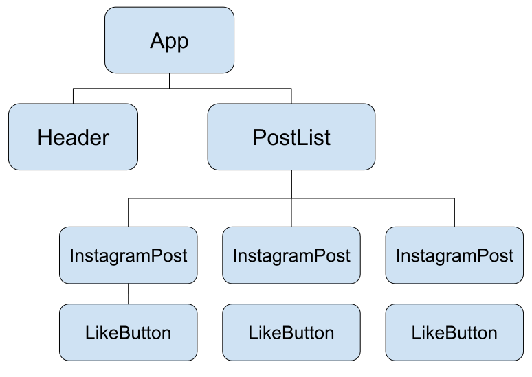
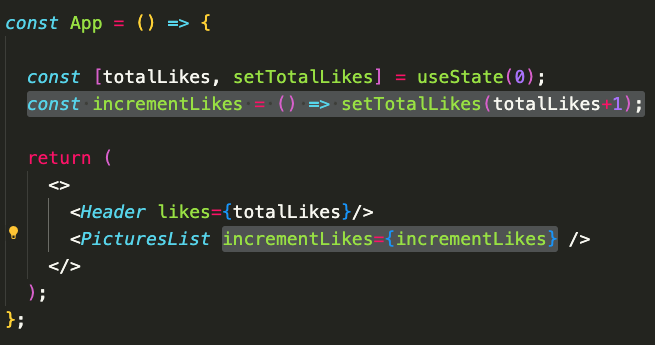
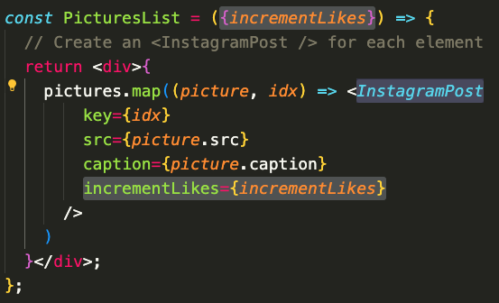
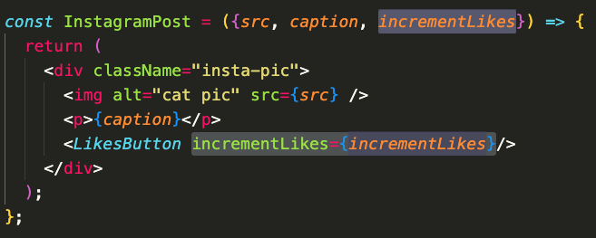
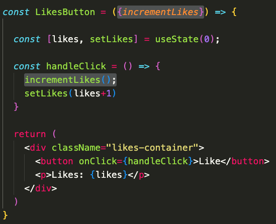
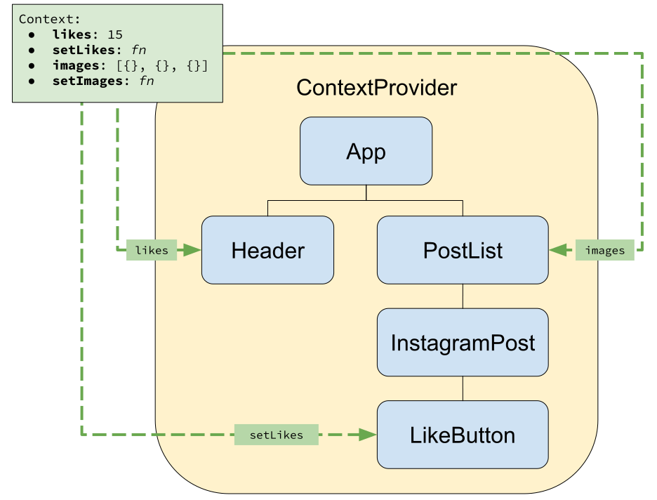

# Context

## Problem: Props Drilling

Consider the instagram clone app that renders something like this:

> Note how there is a **total tally** of likes at the top that sums the likes on each individual picture.

<div style="display: flex; gap:1rem">
  
  
</div><br>

To achieve the `totalLikes` feature, we need to make a `totalLikes` piece of state and pass down a function `incrementLikes` that can modify that value.

The problem is that the component that uses `incrementLikes` is `LikesButton` which is 3 layers away from `App`. So we first pass it to `PicturesList`...



Which passes it to each `InstagramPost` instance...



Which passes it down to `LikesButton`...



Which finally uses it.



This act of passing a piece of state through multiple intermediate components that don't use that state is called **props drilling**.

It isn't _always_ an issue but at about 3 layers, it starts to feel tedious.

## Solution: useContext

The solution is to create something called a **Context**. Think of Context as an object where we can store global data and that any component within that context's scope can access that data.



To use React's Context API, there are **3 concepts to understand**.

- Making a Context object - `Context = createContext()`
- Rendering a Context Provider - `<Context.Provider values={} />`
- Getting values from a Context - `useContext()`

### 1. Create a context object

This is certainly the simplest step. It will almost always look like this:

```jsx
// src/context/Context.jsx
import { createContext } from "react";

const Context = createContext();

export default Context;
```

- We create a new folder called `context/` in our `src` folder
- `createContext` is a named export of the `react` library
- We invoke `createContext` to create a new `Context` object which we export.

### 2. Render a Context Provider

The main reason why we create a `Context` object is because it has a `.Provider` property that we want to use.

`Context.Provider` is a React component that we wrap around a portion that we want to give access to the Context (we can even wrap it around the entire `App` if we wanted to).

Below, we wrap the `Context.Provider` around the `PicturesList` component, giving it and all of its descendants access to the value `incrementLikes`

```jsx
import "./App.css";
import Header from "./components/Header";
import PicturesList from "./components/PicturesList";
import { useState } from "react";
import Context from "./context/Context";

const App = () => {
  const [totalLikes, setTotalLikes] = useState(0);
  const incrementLikes = () => setTotalLikes(totalLikes + 1);

  return (
    <>
      <Header likes={totalLikes} />
      <Context.Provider value={incrementLikes}>
        <PicturesList />
      </Context.Provider>
    </>
  );
};

export default App;
```

- We first import the `Context` we just created.
- `Context.Provider` is a component that we can wrap around any piece of the application that we want to have access to the context data.
- The `value` prop of the `Context.Provider` determines the data available to the children of the `Context.Provider`
- Now, we can safely remove the `incrementLikes` prop from the `PicturesList` and all intermediate components.

### 3. Use the Context

Any component that is a descendant from a `Context.Provider` may utilize the `value` of that provider using the `useContext` hook from `react`:

```jsx
import { useState, useContext } from "react";
import Context from "../context/Context";

const LikesButton = () => {
  const [likes, setLikes] = useState(0);
  const incrementLikes = useContext(Context);

  const handleClick = () => {
    incrementLikes();
    setLikes(likes + 1);
  };

  return (
    <div className="likes-container">
      <button onClick={handleClick}>Like</button>
      <p>Likes: {likes}</p>
    </div>
  );
};

export default LikesButton;
```

- `useContext` is imported from `react` alongside `useState`
- The `Context` itself is also imported. This will be needed when we invoke `useContext`
- `useContext` is invoked at the top of the `LikesButton` component. It takes in a `Context` object and returns the `value` prop of the associated `Context.Provider`.

> We can take this even further and use the Context for every value in the application. However, there is a delicate balance between storing TOO much in context and keeping the state close to the components that need it.

## Summary

Context provides an alternative to **props drilling**.

Think of Context as an object where we can store global data and that any component within that context's scope can access that data.

To use React's Context API, there are **3 concepts to understand**.

- Making a Context object - `Context = createContext()`
- Rendering a Context Provider - `<Context.Provider values={} />`
- Getting values from a Context - `useContext()`


