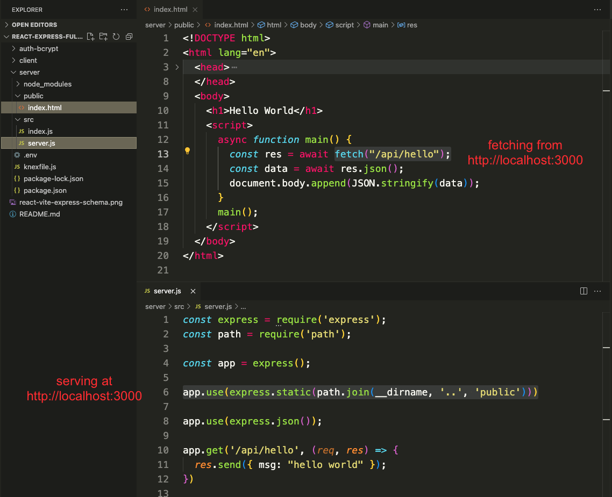

# React + Vite + Express

https://github.com/NathanKr/react-vite-express-setup

## The problem - why we need a "proxy"

### Serving static non-React assets

So far, our full-stack applications were powered by an express back-end serving static ("ready-to-go") front-end assets in a `public/` folder (HTML, CSS, and JS with an `index.html` as the "entry point").

```js
app.use(express.static(path.join(__dirname, "..", "public")));
```



Because those assets were being served by our own back-end server, `fetch` calls from the front end would be sent directly to the backend _without having to specify the host or port_.

> Suppose our express server was running at `http://localhost:3000` and it has an `/api/hello` endpoint.
> Front-end static assets are also being served at `localhost:3000`. Those front-end static assets can make a `fetch('/api/hello')` call without specifiying a different host or port which would automatically fetch from `localhost:3000/api/hello` (from the same origin).

Those projects didn't use React though.

### Serving a React Front-End In Production

**In production**, React applications are compiled into static assets and can be served in the same manner as described above. This is done by running `npm build` to create the static version of our application.

By default, `npm build` will create a `dist/` folder. We want to build this application in the same `public` folder that is in our `server/` so we need to change the `vite.config.js` file:

```js
import { defineConfig } from "vite";
import react from "@vitejs/plugin-react";
import path from 'path'; // importing path

const publicDir = path.join(__dirname, '..', 'public');

// https://vitejs.dev/config/
export default defineConfig({
  server: {
  plugins: [react()],
  build: {
    outDir: publicDir, // set the build directory
    emptyOutDir: true, // overwrite what was in there
  },
});
```

### React uses a Dev Server in Development

However, **in development**, we use a development server that dynamically compiles our code before serving it (so that we don't have to build our project every single time we make a change).

This development server needs to run on its own port.

> Vite provides a development server for us when we run `npm run dev` which serves our React application on port `5173`.

**The problem** is that if our React development server is running on port `5173` and our Express server is running on port `3000`, any `fetch` calls made on the front-end will be automatically routed to port `5173`, not port `3000`.

> Instead of...
>
> ```js
> fetch("/api/hello"); // this would fetch from localhost:5173
> ```
>
> We would have to specify the entire path for our fetch if we wanted to reach across from one port to another:
>
> ```js
> fetch("http://localhost:3000/api/hello");
> ```
>
> But even this gives us CORS errors...

### Configure a proxy

**The solution** is to configure a **proxy**. A proxy is just a substitution for something (or someone) else.

In this case, we want to substitute the development server's host+port for the express server's host+port.


If we update the `client/vite.config.js` file to look like this:

```js
import { defineConfig } from "vite";
import react from "@vitejs/plugin-react";
import path from "path";

const publicDir = path.join(__dirname, "..", "public");

// https://vitejs.dev/config/
export default defineConfig({
  plugins: [react()],
  build: {
    outDir: publicDir,
    emptyOutDir: true,
  },
  server: {
    proxy: {
      "/api": {
        target: "http://localhost:3000", // specify the port of your Express server
        changeOrigin: true,
        secure: false,
        ws: true,
      },
    },
  },
});
```

We basically are saying that any `fetch` that starts with the `/api` endpoint will be redirected to `localhost:3000` (or wherever you are running your Express server from).
