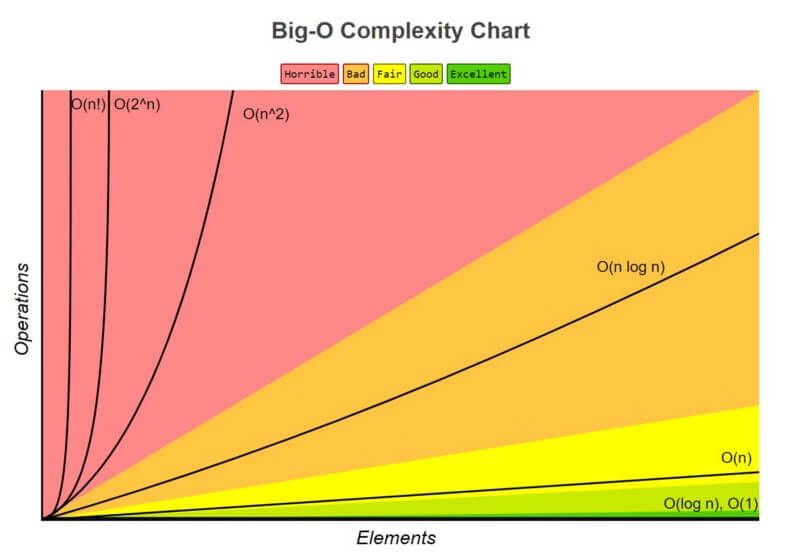

# Big O Notation

**Ben's Essential Questions:**
* What is runtime analysis?
* How do you count operations in an algorithm?
* How do you determine the Big-O notation for an algorithm?
* What are the 5 most important Big-O notations?
* Why is runtime efficiency important?

https://www.toptal.com/developers/sorting-algorithms

**Agenda**
* Intro - A look at sorting algorithms
* Why is runtime efficiency important?
* What is runtime analysis?
* Big-O Notation
* Worst-case runtime
* Examples of Runtimes

## Different Algorithms, Same Problem

**Q: Why is studying runtime efficiency important?**

<details><summary>Ben's Answer</summary>

Ideally, we want our programs to be as efficient as possible, particularly when computing resources are expensive or limited.

Studying runtime efficiency helps us learn the most efficient ways to solve problems. It can also help us quickly identify efficient/inefficient algorithms.

</details>

Imagine you have a sorted array of lowercase letters. You need to write an algorithm to find the index of a letter (let's say `'f'`) or return `-1` if no such letter exists. How would you write such an algorithm?

```js
const letters = ['a', 'c', 'd', 'f', 'j', 'm', 'o', 'p', 'u', 'x'];
```

First, come up with an algorithm. Then peek at the two solutions below. Which is more efficient? How can you know?

<details><summary>Solution 1</summary>

```js
function findIndexInSortedArray(arr, target) {
    for (let i = 0; i < arr.length; i++) {
        if (arr[i] === target) {
            return i;
        }
    }
    return -1;
}
```

This algorithm has a **linear** runtime. How do you know that quickly? It has a for loop that runs once per item in the array.

It's pretty efficient.

</details>

<details><summary>Solution 2</summary>

```js
function findIndexInSortedArray(arr, target) {
    let start = 0;
    let end = arr.length - 1;
 
    while (start <= end) {
    	let mid = Math.floor((start + end) / 2);
    	
    	if (arr[mid] === target) return mid;
    	else if (target < arr[mid]) end = mid - 1;
    	else if (target > arr[mid]) start = mid + 1;
    }
    return -1;
}
```

This algorithm has a **logarithmic** runtime. How do you know that quickly? It divides the "problem space" in half on each iteration. 

Even though it has more code than the other solution, it's also more efficient!

</details>

## What is runtime analysis?

Runtime analysis is a theoretical calculation of "how long" a particular algorithm takes to execute. "How long" can be measured by counting the number of operations executed in the algorithm.

For example, the algorithm for getting the first value of an array requires just one operation:

```js
function getFirstValue(arr) {
    return arr[0];
}

const nums = [1,2,3];
const letters = ['a','b','c','d','...','x','y','z'];

const firstNum = getFirstValue(nums); // 1
const firstLetter = getFirstValue(letters); // 'a'
```

Let's look at a slightly more complex algorithm. 

**Q: How many operations will `printArray` perform?**
```js
function printArray(arr) {
    for (let i = 0; i < arr.length; i++) {
        console.log(arr[i])
    }
}

const nums = [1,2,3];
const letters = ['a','b','c','d','...','x','y','z'];

printArray(nums);
printArray(letters);
```

<details><summary>Ben's Answer</summary>

`printArray`'s number of operations changes depending on how many values are in the array. We can break down the algorithm's operations like this:
* We know that `let i = 0` is an operation that happens once before the loop starts
* We know that `i < arr.length` is checked once before EVERY loop
* We know that `console.log(arr[i])` happens once during EVERY loop
* We know that `i++` happens once after EVERY loop.

We also know that the number of loops is equal to the number of elements in the array. If we have 5 elements in the array, we will have 5 loops. If we have 100 elements in the array, we will have 100 loops. If we have `n` elements in the array, we will have `n` loops.

So, we have one operation that happens once and 3 operations that happen `n` times. So, this algorithm runs `3n + 1` times! 
</details>

### Input Size to Operations Ratio

When measuring the _efficiency_ of an algorithm, **the relationship between the size of the input and number of operations** is most important. 

Notice that in `getFirstValue` the same number of operations (1) can be used regardless of how big the array is. However, in `printArray`, the number of operations is dependent on the size of the array we pass in (`3n + 1`).

This means that `getFirstValue` is a more efficient algorithm than `printArray`. And that's okay! Some algorithms can only be so efficient. 													
## Comparing Runtimes - Big-O notation

When talking about runtimes, we use a notation called [**Big-O Notation**](https://simple.wikipedia.org/wiki/Big_O_notation). 

When using Big-O notation, algorithms with runtimes like `3n + 1` get boiled down to the _largest term_ with _coefficients_ removed.

**Q: What is the largest term in `3n + 1`? What is the coefficient?**

<details><summary>Ben's Answer</summary>

`3n` is the largest term and `3` is the coefficient. So, we only care about the `n`.

</details>

Everything essentially boils down to seven Big-O runtimes but the five below are the ones you'll most commonly encounter.

| Runtime Name 	| Big O Notation 	| How to identify                                                                                                	|
|--------------	|----------------	|--------------------------------------------------------------------------------------------------------	|
| Constant     	| O(1)           	| No iteration                                                                 	|
| Logarithmic  	| O(log n)       	| The input size is divided in half on each iteration        	|
| Linear       	| O(n)           	| An un-nested loop over elements of an array                                             	|
| Log-Linear   	| O(n log n)     	| A O(log n) sub-algorithm is executed within a loop 	|
| Quadratic    	| O(n^2)         	| A nested loop                                                                              	|

> Other runtimes include exponential (`O(2^n)`) and factorial (`O(n!)`) but we won't cover these.

These runtimes are written in order of efficiency. The chart below shows which kinds of runtimes are considered best and where we start to get concerned.



This chart shows why we focus on the largest term with coefficients removed.
* An algorithm that has `3n + 5` operations will scale roughly at the same rate that another algorithm that has `10n + 100` operations
* An algorithm that has `3n^2 + 5` operations will scale MUCH faster than another algorithm that has `3n + 5` operations.
* So, we mostly care about the `n^2` vs. the `n` portions

### Big-O Runtime Challenge:

**Q: What is the Big-O notation for the algorithm below? How do you know?**

```js
function bubbleSort(arr) {
  for (let i = 0; i < arr.length; i++) {
    for (let j = i + 1; j < arr.length; j++) {
	  if (arr[j] < arr[i]) {
        let temp = arr[i];
        arr[i] = arr[j];
        arr[j] = temp; 
      }
    }
  }
}
```

<details><summary>Ben's Answer</summary>

This has a Big-O runtime of O(n^2) because it uses nested loops!

</details>

## Big-O is a Worst-Case Notation

Consider the scenario: we have an array of letters in some random order and I want to know if a particular letter is in the array.

```js
const letters = ['a', 'z', 'x', 'b', 'y', 'c'];
```

The algorithm for solving this requires us to iterate through every single value in the array, checking if each one is the letter we are looking for:

```js
function isInArray(arr, value) {
    for(let i = 0; i < arr.length; i++) {
        if (arr[i] === value) {
            return true;
        }
    }
    return false;
}

const letters = ['a', 'z', 'x', 'b', 'y', 'c'];
isInArray(letters, 'a');
isInArray(letters, 'x');
isInArray(letters, 'c');
```

<details><summary>Q1: How many iterations of the `for` loop will occur to find the letter `'a'`? What about the letter `'x'`? What about `'c'`?</summary>

Finding the letter `'a'` takes one iteration. Finding `'x'` takes 3 iterations. Finding `'c'` takes 6 iterations. 
</details>

<details><summary>Q2: What is the worst-case scenario for this kind of algorithm? What is the best-case scenario?</summary>

The best-case scenario is finding the letter at the beginning of the array. The worst-case scenario is finding the letter at the end of the array.

</details>

<details><summary>Q3: How many iterations would it take in th worst-case scenario if there were 100 values in the array?</summary>
In an array of 100 values, the worst-case scenario would require 100 iterations.
</details>

<details><summary>Q4: If we have an array with `n` elements, what is the worst-case scenario number of operations?</summary>

The worst-case scenario is `n` operations! This kind of runtime, where the number of operations increases at the same rate as the size of input is called **linear runtime**.

</details>

<details><summary>Q5: Why should we focus on the worst-case runtime?</summary>

By focusing on the worst-case scenario, we can be prepared for that scenario. Maybe we are on the IT team and need to know how much computing power to provide. If we use the worst-case runtime as our benchmark, we can be prepared for anything. 

</details>

## Runtime Visualizations / Examples 

#### Logarithmic: O(log n)

These problems typically involve dividing the size of the input in half on each iteration. The most common example of this is a [**binary search algorithm**](https://www.youtube.com/watch?v=E6IOrZUpvSE). 

#### Linear: O(n)

As the size of the input array grows, the runtime increases by the same amount:

```js
function indexOf(arr, valueToFind) {
    for (let i = 0; i < arr.length; i++) {
        if (arr[i] === valueToFind) {
            return i;
        }
    }
    return -1;
}
```

#### Linear Logarithmic: O(n log n)

We need to perform some logarithmic algorithm once per element in an array. The most common example is merge sort:

Merge Sort Visualizations:
* https://www.youtube.com/watch?v=4VqmGXwpLqc&ab_channel=MichaelSambol
* https://www.youtube.com/watch?v=ZRPoEKHXTJg&ab_channel=TimoBingmann

#### Quadratic: O(n^2)

Slower sorting algorithms like **bubble sort**.

https://visualgo.net/en/sorting

```js
function bubbleSort(arr) {
    for (let i = 0; i < arr.length; i++) {
		for (let j = i + 1; j < arr.length; j++) {
			if (arr[j] < arr[i]) {
				let temp = arr[i];
        		arr[i] = arr[j];
        		arr[j] = temp; 
			}
		}
	}
}
```


